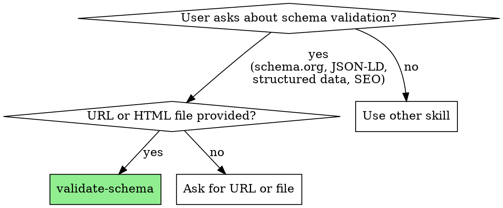

# Schema.org Validator

Validates structured data markup (JSON-LD, Microdata, RDFa) using Google's validator.schema.org API.

## When to Use



Use this skill when:
- User asks to validate schema.org markup
- User wants to check JSON-LD structured data
- User asks about structured data errors or warnings
- User wants to verify SEO structured data implementation

## Instructions

### 1. Determine Input Type

**For live public URLs:**
```bash
curl -s -X POST 'https://validator.schema.org/validate?url=[URL]&output=json' | tail -c +5 | jq
```

**For local HTML files (static, no JS rendering needed):**
```bash
curl -s -X POST 'https://validator.schema.org/validate?output=json' --data-urlencode "html@[filepath]" | tail -c +5 | jq
```

**For localhost/dev servers (static HTML only):** Pipe HTML directly to the validator:
```bash
curl -s "http://localhost:3000/page" | curl -s -X POST 'https://validator.schema.org/validate?output=json' --data-urlencode "html@-" | tail -c +5 | jq
```

**For localhost/dev servers with JavaScript-rendered content (RECOMMENDED for SPAs and dynamic sites):**

Use Chrome headless to render the page fully, then pipe directly to the validator:
```bash
/Applications/Google\ Chrome.app/Contents/MacOS/Google\ Chrome \
  --headless --dump-dom "http://127.0.0.1:5500/page" 2>/dev/null | \
  curl -s -X POST 'https://validator.schema.org/validate?output=json' \
  --data-urlencode "html@-" | tail -c +5 | jq
```

This executes JavaScript and captures the fully-rendered DOM, ensuring all dynamically-generated schema.org markup is included in the validation. The `@-` tells curl to read from stdin, avoiding temp files.

**Note:** If Chrome is not at the default macOS path, check common locations:
- macOS: `/Applications/Google Chrome.app/Contents/MacOS/Google Chrome`
- Linux: `google-chrome` or `chromium-browser`
- Windows: `C:\Program Files\Google\Chrome\Application\chrome.exe`

### 2. Parse Response

Key response fields:
- `totalNumErrors`: Number of validation errors
- `totalNumWarnings`: Number of warnings
- `numObjects`: Count of schema.org entities found
- `tripleGroups`: Detailed breakdown of each entity
- `errors`: Array of error messages

### 3. Format Results

Present the results in a clear, structured format:

```
# Schema.org Validation Report: [URL/File]

## Summary
- **Status**: [VALID / HAS ERRORS / HAS WARNINGS / NO SCHEMA FOUND]
- **Entities Found**: [numObjects]
- **Errors**: [totalNumErrors]
- **Warnings**: [totalNumWarnings]

## Entities Detected

| Type | Properties | Errors | Warnings |
|------|------------|--------|----------|
| [Type] | [property list] | [count] | [count] |

## Issues Found

### Errors
- [List each error with context]

### Warnings
- [List each warning with context]

## Recommendations
[Provide actionable fixes for any issues found]
```

### 4. Error Handling

If validation fails:
- Check if URL is accessible
- For local files, verify file exists and contains HTML
- Note that validator.schema.org is undocumented and may rate-limit

## Example Usage

User: "Validate the schema.org markup on https://example.com"
User: "Check the JSON-LD in my local index.html"
User: "Does my localhost site have valid structured data?"

## Tips

- The `)]}'` prefix (4 bytes) in responses is an anti-JSON hijack measure; strip with `tail -c +5`
- Use `jq` for readable JSON output
- For sites without schema.org markup, `numObjects` will be 0
- Check `tripleGroups[].nodes[].errors` for per-entity issues
- Nested entities (like Review inside Product) appear in `nodeProperties`
