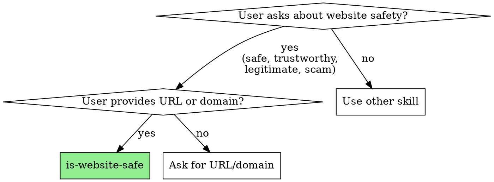
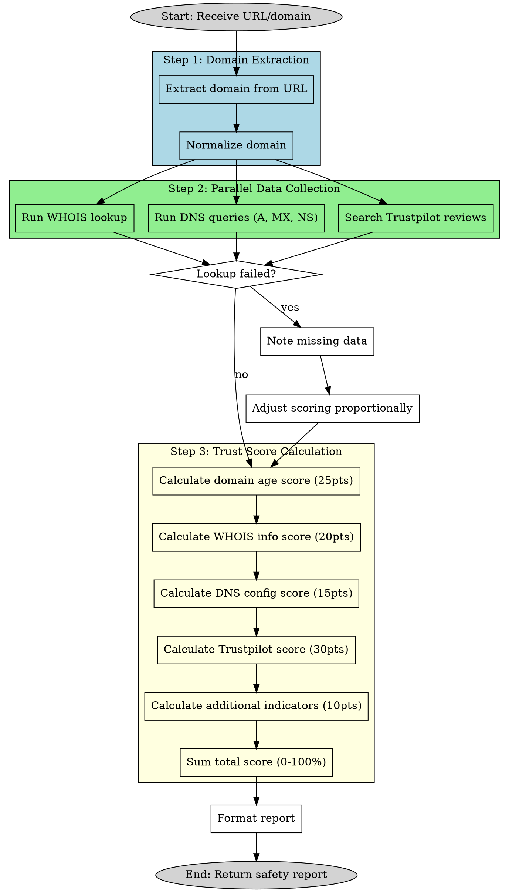

# Website Safety Analyzer

This skill performs a comprehensive safety and trustworthiness analysis of any website by examining domain registration details, DNS configuration, online reviews, and security indicators.

## When to Use



Use this skill when:
- User asks "Is [website] safe?"
- User wants to check if a site is trustworthy/legitimate
- User asks about domain reputation or age
- User wants to avoid scams or phishing sites

## Process Flow



## Instructions

When the user provides a website URL, follow these steps:

### 1. Extract and Normalize the Domain

Extract the domain from the provided URL:
- Remove protocol (http://, https://)
- Remove www. prefix if present
- Remove path, query parameters, and fragments
- Handle both bare domains (example.com) and full URLs (https://www.example.com/path)

### 2. Gather Domain Intelligence

Collect data using these tools in parallel:

**WHOIS Lookup:**
```bash
whois [domain]
```
Extract: registrar, creation date, expiration date, registrant info (if available), nameservers

**DNS Information:**
```bash
dig [domain] ANY +noall +answer
dig [domain] A +short
dig [domain] MX +short
```
Extract: A records (IP addresses), MX records (email servers), nameservers

**Trustpilot Reviews:**
Search for "[domain] trustpilot" using WebSearch and analyze:
- Overall rating (out of 5 stars)
- Number of reviews
- Recent review sentiment
- Common complaints or praise

### 3. Calculate Trust Score

Calculate a trust score (0-100%) based on these weighted factors:

**Domain Age (25 points):**
- 10+ years: 25 points
- 5-10 years: 20 points
- 2-5 years: 15 points
- 1-2 years: 10 points
- 6-12 months: 5 points
- Less than 6 months: 0 points

**WHOIS Information (20 points):**
- Complete registrant info visible: 20 points
- Partial info (privacy protection): 10 points
- No info or suspicious: 0 points
- Deduct 10 if expiring within 30 days

**DNS Configuration (15 points):**
- Valid A records: 5 points
- MX records present: 5 points
- Multiple nameservers: 5 points

**Trustpilot Rating (30 points):**
- 4.5-5.0 stars: 30 points
- 4.0-4.4 stars: 25 points
- 3.5-3.9 stars: 20 points
- 3.0-3.4 stars: 15 points
- 2.5-2.9 stars: 10 points
- 2.0-2.4 stars: 5 points
- Below 2.0 stars: 0 points
- No reviews found: 15 points (neutral)

**Additional Indicators (10 points):**
- HTTPS available: 5 points
- Known brand/established site: 5 points

### 4. Format the Results

Present the results in a clear, structured format:

```
# Website Safety Report: [domain]

## Trust Score: [X]% - [RATING]

[RATING] categories:
- 80-100%: TRUSTED ✓
- 60-79%: LIKELY SAFE (Proceed with Caution)
- 40-59%: MODERATE RISK (Exercise Caution)
- 20-39%: HIGH RISK (Not Recommended)
- 0-19%: DANGEROUS (Avoid)

## Detailed Analysis

| Category | Details |
|----------|---------|
| Domain Age | [X years/months] - Registered on [date] |
| Expiration | [date] ([X days remaining]) |
| Registrar | [registrar name] |
| Registrant | [info or "Hidden (Privacy Protected)"] |
| IP Address | [primary IP] |
| Location | [country/region if detectable] |
| Email Server | [MX records or "None found"] |
| Nameservers | [list of NS] |
| Trustpilot Rating | [X.X stars] ([Y reviews]) or "No reviews found" |
| HTTPS Support | [Yes/No] |

## Security Indicators

[List positive and negative indicators found]

**Positive:**
- [e.g., "Domain registered for 8 years"]
- [e.g., "Strong Trustpilot rating (4.7/5)"]

**Concerns:**
- [e.g., "Registrant information hidden"]
- [e.g., "Domain expiring soon"]

## Recommendation

[Provide a clear recommendation based on the trust score and analysis]
```

### 5. Error Handling

If any lookup fails:
- Note which information is unavailable
- Continue with remaining checks
- Adjust trust score calculation accordingly (use proportional scoring)
- Mention data limitations in the report

### 6. Important Notes

- Some domains use privacy protection services (normal for personal sites)
- New domains aren't necessarily unsafe (lack of history ≠ malicious)
- Trustpilot absence doesn't mean untrustworthy (many legitimate sites have no reviews)
- Consider context: small business sites may have less data than major brands
- Always mention if the analysis is limited by missing data

## Example Usage

User: "Is amazon.com safe?"
User: "Check if suspicious-deals-2024.xyz is trustworthy"
User: "Analyze the safety of https://www.example-shop.com/products"

## Tips

- When Trustpilot data is found via WebSearch, use WebFetch to extract the specific rating and review count
- For well-known domains (google.com, microsoft.com, etc.), you can add bonus points
- If WHOIS returns rate limiting errors, note this and proceed with other checks
- DNS lookups are usually fast - run them in parallel with WHOIS
- Consider domain extension (.com, .org vs. .xyz, .tk) as a minor factor
