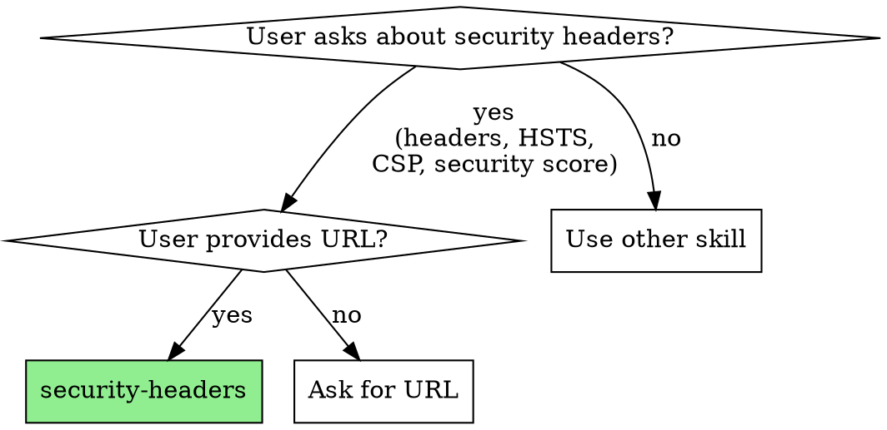

# Security Headers Analyzer

This skill performs a comprehensive security headers analysis of any website by examining HTTP response headers and calculating a security score based on industry best practices.

## When to Use



Use this skill when:
- User asks about website security headers
- User wants to check HTTP security configuration
- User mentions HSTS, CSP, X-Frame-Options, or other security headers
- User wants to improve their website's security posture
- User asks for a security audit of HTTP headers

## Process Flow

```dot
digraph process_flow {
    rankdir=TB;

    subgraph cluster_fetch {
        label="Step 1: Fetch Headers";
        style=filled;
        fillcolor=lightblue;
        "Make HEAD request to URL" [shape=box];
        "Follow redirects" [shape=box];
        "Extract all response headers" [shape=box];
    }

    subgraph cluster_analysis {
        label="Step 2: Header Analysis";
        style=filled;
        fillcolor=lightgreen;
        "Check HSTS (25pts)" [shape=box];
        "Check CSP (25pts)" [shape=box];
        "Check X-Frame-Options (10pts)" [shape=box];
        "Check X-Content-Type-Options (10pts)" [shape=box];
        "Check Referrer-Policy (10pts)" [shape=box];
        "Check Permissions-Policy (10pts)" [shape=box];
        "Check COEP/COOP/CORP (10pts)" [shape=box];
    }

    subgraph cluster_quality {
        label="Step 3: Quality Assessment";
        style=filled;
        fillcolor=lightyellow;
        "Validate HSTS directive values" [shape=box];
        "Parse and validate CSP policy" [shape=box];
        "Check for insecure headers" [shape=box];
        "Identify security issues" [shape=box];
    }

    subgraph cluster_scoring {
        label="Step 4: Score Calculation";
        style=filled;
        fillcolor=lightcoral;
        "Sum header scores" [shape=box];
        "Apply penalties for issues" [shape=box];
        "Calculate final grade (A+ to F)" [shape=box];
    }

    "Start: Receive URL" [shape=oval style=filled fillcolor=lightgray];
    "Request failed?" [shape=diamond];
    "Return error message" [shape=box];
    "Format report" [shape=box];
    "End: Return security report" [shape=oval style=filled fillcolor=lightgray];

    "Start: Receive URL" -> "Make HEAD request to URL";
    "Make HEAD request to URL" -> "Follow redirects";
    "Follow redirects" -> "Extract all response headers";
    "Extract all response headers" -> "Request failed?";
    
    "Request failed?" -> "Return error message" [label="yes"];
    "Return error message" -> "End: Return security report";
    
    "Request failed?" -> "Check HSTS (25pts)" [label="no"];
    "Check HSTS (25pts)" -> "Check CSP (25pts)";
    "Check CSP (25pts)" -> "Check X-Frame-Options (10pts)";
    "Check X-Frame-Options (10pts)" -> "Check X-Content-Type-Options (10pts)";
    "Check X-Content-Type-Options (10pts)" -> "Check Referrer-Policy (10pts)";
    "Check Referrer-Policy (10pts)" -> "Check Permissions-Policy (10pts)";
    "Check Permissions-Policy (10pts)" -> "Check COEP/COOP/CORP (10pts)";
    "Check COEP/COOP/CORP (10pts)" -> "Validate HSTS directive values";
    
    "Validate HSTS directive values" -> "Parse and validate CSP policy";
    "Parse and validate CSP policy" -> "Check for insecure headers";
    "Check for insecure headers" -> "Identify security issues";
    "Identify security issues" -> "Sum header scores";
    
    "Sum header scores" -> "Apply penalties for issues";
    "Apply penalties for issues" -> "Calculate final grade (A+ to F)";
    "Calculate final grade (A+ to F)" -> "Format report";
    "Format report" -> "End: Return security report";
}
```



## Instructions

### 1. Fetch HTTP Headers

Make a HEAD request to the provided URL to fetch headers:

```bash
curl -I -L -s "[url]"
```

Options:
- `-I` : HEAD request (headers only)
- `-L` : Follow redirects
- `-s` : Silent mode

Extract all headers from the response, especially security-related ones.

### 2. Analyze Security Headers

Check for presence and quality of each security header:

#### Strict-Transport-Security (HSTS) - 25 points
**Scoring:**
- Not present: 0 points
- Present without directives: 10 points
- Present with `max-age` only: 15 points
- Present with `max-age` and `includeSubDomains`: 20 points
- Present with `max-age`, `includeSubDomains`, and `preload`: 25 points

**Quality checks:**
- `max-age` should be at least 31536000 (1 year)
- Should include `includeSubDomains`
- Ideally includes `preload`

**Penalties:**
- `max-age` less than 10886400 (126 days): -5 points
- Missing `includeSubDomains`: -2 points

#### Content-Security-Policy (CSP) - 25 points
**Scoring:**
- Not present: 0 points
- Present but with `unsafe-inline` or `unsafe-eval`: 10 points
- Present with restrictive policy: 20 points
- Present with strict policy and no unsafe directives: 25 points

**Quality checks:**
- Should define `default-src`, `script-src`, `style-src`
- Should avoid `unsafe-inline` and `unsafe-eval`
- Should use `nonce-` or `hash-` for inline scripts
- Should include `upgrade-insecure-requests`
- Should define `frame-ancestors`

**Penalties:**
- Contains `unsafe-inline` in `script-src`: -10 points
- Contains `unsafe-eval` in `script-src`: -10 points
- Contains `*` wildcard in `script-src` or `object-src`: -5 points
- Missing `frame-ancestors`: -3 points

#### X-Frame-Options - 10 points
**Scoring:**
- Not present: 0 points
- Present with `ALLOW-FROM` (deprecated): 5 points
- Present with `SAMEORIGIN`: 10 points
- Present with `DENY`: 10 points

**Note:** Can be replaced by CSP `frame-ancestors` directive (then award 10 points if CSP properly sets it).

#### X-Content-Type-Options - 10 points
**Scoring:**
- Not present: 0 points
- Present with value `nosniff`: 10 points
- Present with other value: 0 points

#### Referrer-Policy - 10 points
**Scoring:**
- Not present: 0 points
- Present with weak policy (`unsafe-url`, `origin`, `no-referrer-when-downgrade`): 5 points
- Present with strong policy (`no-referrer`, `same-origin`, `strict-origin`, `strict-origin-when-cross-origin`): 10 points

#### Permissions-Policy - 10 points
**Scoring:**
- Not present: 0 points
- Present with at least one directive: 10 points

**Common directives to check:**
- `geolocation`, `microphone`, `camera`, `payment`, `usb`, `magnetometer`, `gyroscope`, `accelerometer`

#### Cross-Origin Policies - 10 points (Bonus)
**Cross-Origin-Embedder-Policy (COEP):**
- Present with `require-corp` or `credentialless`: +5 points

**Cross-Origin-Opener-Policy (COOP):**
- Present with `same-origin` or `same-origin-allow-popups`: +3 points

**Cross-Origin-Resource-Policy (CORP):**
- Present with `same-site`, `same-origin`, or `cross-origin`: +2 points

### 3. Identify Security Issues

Check for headers that leak information or pose security risks:

**Information Disclosure (Penalties):**
- `Server` header reveals detailed version: -5 points
- `X-Powered-By` header present: -5 points
- `X-AspNet-Version` header present: -5 points
- `X-AspNetMvc-Version` header present: -5 points

**Cookie Security Issues:**
- Cookies without `Secure` flag: -3 points per cookie (max -9)
- Cookies without `HttpOnly` flag: -3 points per cookie (max -9)
- Cookies without `SameSite` attribute: -2 points per cookie (max -6)

**CORS Issues:**
- `Access-Control-Allow-Origin: *` on non-CDN: -5 points
- `Access-Control-Allow-Credentials: true` with wildcard origin: -10 points

### 4. Calculate Final Score and Grade

**Total Score:** Sum of all header points minus penalties (0-100+ scale)

**Grade Scale:**
- **A+ (90-100+)**: Excellent security posture
- **A (80-89)**: Good security with minor improvements needed
- **B (70-79)**: Adequate security with some gaps
- **C (60-69)**: Below average, several improvements needed
- **D (50-59)**: Poor security, major improvements required
- **F (0-49)**: Failing security posture, immediate action needed

### 5. Format the Results

Present the results in a clear, structured format:

```
# Security Headers Report: [URL]

## Security Grade: [GRADE] - [SCORE]/100

## Header Analysis

| Header | Status | Score | Details |
|--------|--------|-------|---------|
| **Strict-Transport-Security** | ✓ Present / ✗ Missing | [X/25] | [Value or recommendation] |
| **Content-Security-Policy** | ✓ Present / ✗ Missing | [X/25] | [Summary or issues] |
| **X-Frame-Options** | ✓ Present / ✗ Missing | [X/10] | [Value or recommendation] |
| **X-Content-Type-Options** | ✓ Present / ✗ Missing | [X/10] | [Value or recommendation] |
| **Referrer-Policy** | ✓ Present / ✗ Missing | [X/10] | [Value or recommendation] |
| **Permissions-Policy** | ✓ Present / ✗ Missing | [X/10] | [Value or recommendation] |

## Additional Headers (Bonus)

| Header | Status | Score | Details |
|--------|--------|-------|---------|
| **Cross-Origin-Embedder-Policy** | ✓ Present / ✗ Missing | [+X] | [Value if present] |
| **Cross-Origin-Opener-Policy** | ✓ Present / ✗ Missing | [+X] | [Value if present] |
| **Cross-Origin-Resource-Policy** | ✓ Present / ✗ Missing | [+X] | [Value if present] |

## Security Issues Found

[If no issues found:]
✓ No critical security issues detected.

[If issues found:]
### Critical Issues
- [List critical issues with -X points each]

### Warnings
- [List warnings with -X points each]

### Information Disclosure
- [List info disclosure issues with -X points each]

## Recommendations

[Based on grade and missing headers, provide prioritized recommendations:]

### High Priority
1. [Most important missing/misconfigured headers]
2. [Critical security issues to fix]

### Medium Priority
1. [Secondary improvements]
2. [Header optimizations]

### Low Priority
1. [Nice-to-have additions]
2. [Information disclosure cleanup]

## Detailed Header Values

[Show the actual header values for reference:]

```
[Header-Name]: [Header-Value]
[Header-Name]: [Header-Value]
...
```

## Quick Fix Examples

[Provide code snippets for common server configurations:]

### Apache (.htaccess)
```apache
Header always set Strict-Transport-Security "max-age=31536000; includeSubDomains; preload"
Header always set Content-Security-Policy "default-src 'self'; script-src 'self'; ..."
Header always set X-Frame-Options "DENY"
Header always set X-Content-Type-Options "nosniff"
Header always set Referrer-Policy "strict-origin-when-cross-origin"
Header always set Permissions-Policy "geolocation=(), microphone=(), camera=()"
```

### Nginx
```nginx
add_header Strict-Transport-Security "max-age=31536000; includeSubDomains; preload" always;
add_header Content-Security-Policy "default-src 'self'; script-src 'self'; ..." always;
add_header X-Frame-Options "DENY" always;
add_header X-Content-Type-Options "nosniff" always;
add_header Referrer-Policy "strict-origin-when-cross-origin" always;
add_header Permissions-Policy "geolocation=(), microphone=(), camera=()" always;
```

### Cloudflare Workers
```javascript
response.headers.set('Strict-Transport-Security', 'max-age=31536000; includeSubDomains; preload');
response.headers.set('Content-Security-Policy', "default-src 'self'; ...");
response.headers.set('X-Frame-Options', 'DENY');
response.headers.set('X-Content-Type-Options', 'nosniff');
response.headers.set('Referrer-Policy', 'strict-origin-when-cross-origin');
response.headers.set('Permissions-Policy', 'geolocation=(), microphone=(), camera=()');
```
```

### 6. Error Handling

If the URL is unreachable:
- Note that headers could not be fetched
- Provide possible reasons (DNS failure, server down, firewall)
- Skip the analysis

If the URL redirects:
- Follow redirects automatically (already handled by `curl -L`)
- Analyze the final destination's headers
- Note the redirect chain if relevant

### 7. Important Notes

**CSP Complexity:**
- CSP policies can be very complex
- Focus on detecting unsafe directives rather than perfect validation
- Note if CSP is too restrictive (may break functionality)

**Header Precedence:**
- `Content-Security-Policy` `frame-ancestors` takes precedence over `X-Frame-Options`
- Some headers are deprecated but still in use

**Context Matters:**
- Public CDNs may legitimately use `Access-Control-Allow-Origin: *`
- API endpoints may have different requirements than web pages
- Development environments may intentionally have relaxed policies

**HTTPS Requirement:**
- Many security headers only make sense over HTTPS
- Note if the site is not using HTTPS (major issue)

**Regional Differences:**
- Some headers may be required by regulations (GDPR, etc.)
- Check for region-specific security requirements

## Example Usage

User: "Check the security headers for https://browser.style"
User: "Analyze the HTTP security of example.com"
User: "What's the security score for my website https://mysite.com?"
User: "Does github.com have good security headers?"

## Tips

- Use `curl -I -L -s` for efficient header-only requests
- Parse CSP carefully as it can span multiple lines or be split
- Pay special attention to `unsafe-inline` and `unsafe-eval` in CSP
- Check for both old (`X-Frame-Options`) and new (CSP `frame-ancestors`) protection methods
- Consider the context: a CDN may need different headers than a web app
- Provide actionable recommendations, not just scores
- Include code examples for common server configurations
