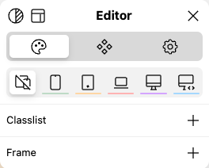
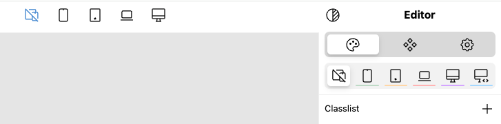

# UI Editor
UI Editor is a highly customizable editor for your CMS. 

## Getting started
Download or reference the script from:

```html
<script src="browser.style/ui/editor/index.js" type="module"></script>
```

Next, download [app.json](browser.style/ui/editor/data/app.json): the default settings and UI for the app. Customize it, translate it, do whatever you want — or leave it as it is — and then reference it using the `files`-attribute in the `<ui-editor>` Web Component:

```html
<ui-editor files="data/app.json"></ui-editor>
```

Now, if you run the site, you should see a "UI"-button at the center bottom of the screen.
Click it, and you'll see a blue outline on the page. Now click on any DOM-node, and you should see this:



This is the basic app with four tools:
- [Styles](browser.style/ui/editor/data/styles.json)
- [Content](browser.style/ui/editor/data/content.json)
- [Elements](browser.style/ui/editor/data/elements.json)
- Settings

You can't see the Content-tool, however, since this only shows up when you click on a DOM-node that has been configured for it (more on this later). You can drag the app around by grabbing the title. 

Change the color-scheme by pressing the top left icon. The icon next to that resets the app's position.

Before we look into extending the app, let's add some niceties:

```html
<ui-editor
  files="data/app.json"
  logo="/favicon.svg"
  open="true"
  openkey="."
  togglekey=",">
</ui-editor>
```

- `logo` adds your custom logo (preferably in `<svg>`) to the button instead of the UI-text.
- `open="true"` mounts the app in it's `open`-state, so you don't need to click on the button.
- `openkey` is a key-command to toggle the app's `open`-state _and_ select the last selected element. The complete key-command is `shift+control+OPENKEY`.
- `togglekey` is a key-command to toggle the app's `open`-state. The complete key-command is `shift+control+TOGGLEKEY`.

### Other attributes

#### `responsive`
Boolean attribute that mounts the app as a sidebar, and then loads the content of the page in an iframe. Requires permissions in either `X-Frame-Options` or `frame-ancestors` (CSP):

```html
<ui-editor
  files="data/app.json"
  logo="/favicon.svg"
  open="true"
  openkey="."
  responsive
  togglekey=",">
</ui-editor>
```

The UI is almost the same. You can configure the frames in `app.json`, where you'll see — as an example — that the phone-frame has `"data-dimensions": "360x640"`.



#### `selectable`
This attribute is a comma-delimited string of selectable nodes.
If you **don't set** the `selectable`-attribute, *all nodes* will be selectable.
Otherwise, only nodes with a matching `data`-attribute will be selectable.

Example:
With `selectable="part"`, nodes with a `data-part`-attribute will be selectable. Notice, that `selectable` expects the `camelcase`-version. So:

```html
<div data-my-cool-component="">
```

Should be:
```html
<ui-editor selectable="myCoolComponent">
```

## Styles
If you didn't already, download [styles.json](browser.style/ui/editor/data/styles.json).
This file was generated by a **utility-helper** (more on this later), but for now we'll place the file in the same directory as `app.json`, and add it to `files`, separated by a comma:

```html
<ui-editor files="data/app.json, data/styles.json"></ui-editor>
```


---


## Components and Parts
The components you want to be editable — content, styles or both — should be wrapped in a `<ui-component>`-element. 

> **Don't worry:** it's a "dummy"-component using `display:contents` in CSS, so it will not generate a box or harm your existing styles.

Each `<ui component>` needs a `key`-attribute, defining a unique component:

```html
<ui-component key="card">
```

The app will, on mount or (new) component-mount, look for matching components in `components.json`.
In this case, if it finds a "card"-component, it will add `data-part`-attributes to editable parts within the component.

You can add more, custom attributes to `<ui-component>`, like:

```html
<ui-component key="card" provider="contentstack" instance="uid72672525">
```

These will, along with the `model` specified in `components.json` be dispatched in events when you edit content (more on that later).


## Multiple Ways of Styling

### Utility
A utility-class consists of the following parts:

`BREAKPOINT` · `BREAKPOINT DELIMITER` · `PREFIX` · `PREFIX DELIMITER` · `VALUE`

An example from Tailwind. For the `md`-breakpoint, set `margin-left` to `2`:

```html
<div class="md:ml-2">...</div>
```

In that example, `md` is the breakpoint, `:` is the breakpoint-delimiter, `ml` is the prefix, `-` is the prefix-delimiter, and `2` is the `value`.

The breakpoint-delimiter can only be used *once* per entry, but the prefix-delimiter can be used (but not recommended) multiple types in the same entry. The first instance will be used as the delimiter.

### Parts
Parts can be set and shared across multiple types of component.

Example:
```html
<!--Card Component-->
<div class="c-card" >
  <h2 data-part="headline">Headline</h2>
</div>

<!--Article Component-->
<article class="c-article">
  <h2 data-part="headline">Headline</h2>
</article>
```

In the example above, both components have a `data-part="headline"`. In the visual editor, both components will be able to select the same headline-style, but only components with the *same* `data-component`-attribute will be updated.

### Properties
If you want to update a CSS Custom Property, use the `data-property`-attribute. 
To set a CSS unit with it, use the `data-unit`-attribute.

Example:
```html
<input type="range" data-property="--fs" value="50">
```

Will return:
```html
--fs: 50;
```

With `data-unit`:

```html
<input type="range" data-property="--fs" data-unit="px" value="50">
```

It will set:
```html
--fs: 50px;
```

### Scope
If you don't set a scope, the property will be set on the input-node itself.
To set the property on *another node*, use the `data-scope`-attribute with one of these values:

- `fieldset`: returns the closest fieldset
- `form`: returns the form, the input belongs to
- `next`: returns nextElementSibling
- `parent`: returns parentNode
- `prev`: returns previousElementSibling
- `root`: returns document.documentElement
- `self`: returns the input itself, same as blank

If `data-scope` has *another* value than the ones mentioned above, a `querySelector` will be used, example:

```html
<input type="range" data-property="--fs" data-unit="px" data-scope="body">
```

---

## Keyboard Shortcuts
For all keyboard-shortcuts: Press `Ctrl+Shift` in addition to the shortcut.

| Key | Description |
| --- | --- |
| , | Toggle the app. Change in `togglekey`-attribute |
| . | Toggle the app *and* open the editor with the last selected element. Change in `openkey`-attribute |
| ↑ | Select parent |
| ↓ | Select first child |
| → | Select next sibling |
| ← | Select previous sibling |
| ⌫ | Delete selected
| ⇞ | Switch position with previous sibling |
| ⇟ | Switch position with next sibling |
| ↖ | Move to first within parent |
| ↘ | Move to last within parent |
| c | Copy selected |
| r | Replace selected |
| v | Paste selected |
| x | Cut selected |
| y | Redo |
| z | Undo |
| 1 | Go to first tool |
| 2 | Go to second tool |
| 3 | Go to third tool |
| 4 | Go to forth tool |

### Navigation

