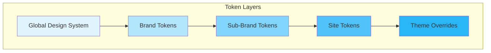
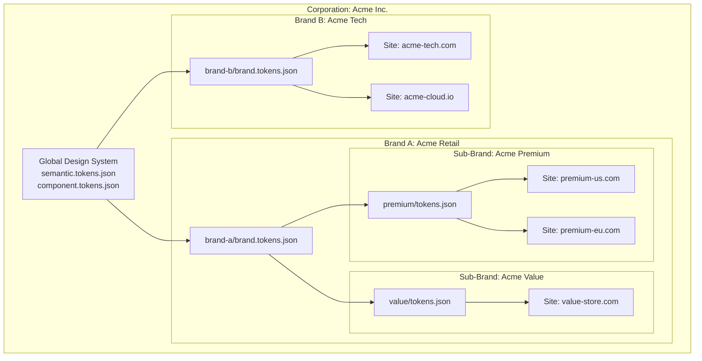
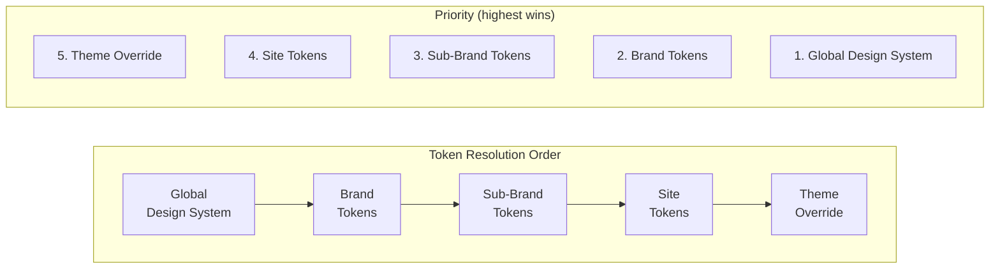
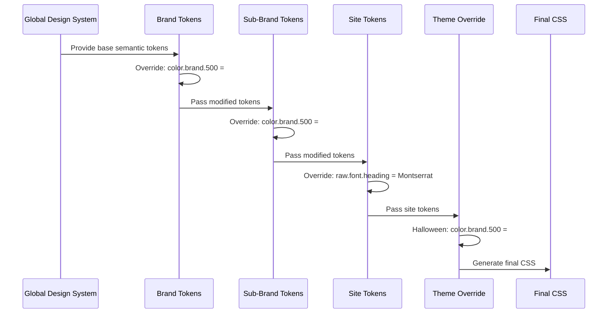
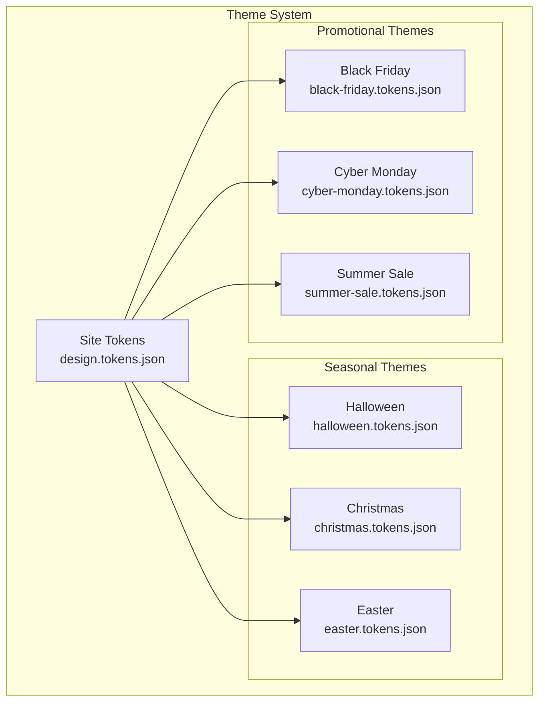
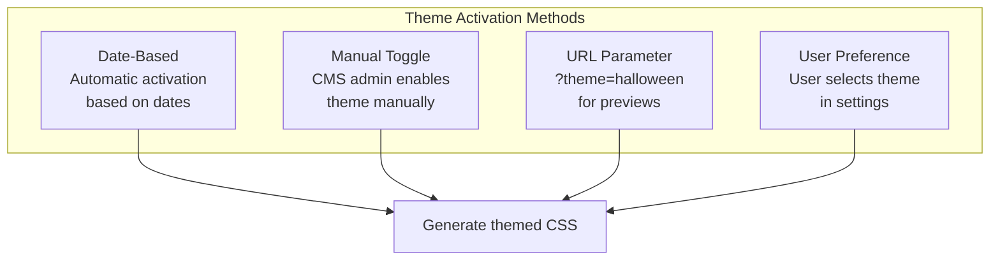
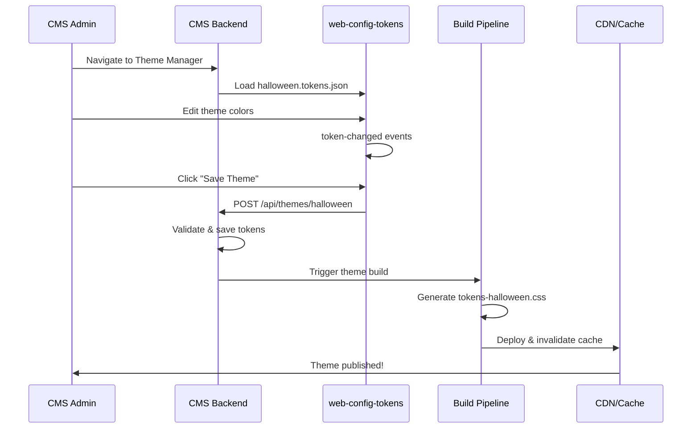

# Brand Hierarchy & Token Inheritance

This document describes the relationship between brands, sub-brands, sites, and temporary themes in a multi-site design token architecture.

---

## Overview



---

## Hierarchical Structure



---

## Token Inheritance Chain



---

## File Structure

```
/your-organization/
│
├── design-system/                      # Level 1: Global Design System
│   ├── semantic.tokens.json            # Shared semantic tokens
│   ├── component.tokens.json           # Shared component tokens
│   └── composites.tokens.json          # Typography, shadows, etc.
│
├── brands/
│   ├── acme-retail/                    # Level 2: Brand
│   │   ├── brand.tokens.json           # Brand-level overrides
│   │   │
│   │   ├── premium/                    # Level 3: Sub-Brand
│   │   │   ├── subbrand.tokens.json    # Sub-brand overrides
│   │   │   │
│   │   │   ├── premium-us/             # Level 4: Site
│   │   │   │   ├── design.tokens.json  # Site-specific raw tokens
│   │   │   │   └── themes/             # Level 5: Themes
│   │   │   │       ├── halloween.tokens.json
│   │   │   │       ├── christmas.tokens.json
│   │   │   │       └── black-friday.tokens.json
│   │   │   │
│   │   │   └── premium-eu/
│   │   │       └── design.tokens.json
│   │   │
│   │   └── value/
│   │       ├── subbrand.tokens.json
│   │       └── value-store/
│   │           └── design.tokens.json
│   │
│   └── acme-tech/
│       ├── brand.tokens.json
│       ├── acme-tech-com/
│       │   └── design.tokens.json
│       └── acme-cloud-io/
│           └── design.tokens.json
│
└── build/                              # Generated outputs
    ├── premium-us/
    │   ├── tokens.css
    │   ├── tokens-halloween.css
    │   └── tokens-black-friday.css
    └── ...
```

---

## Token Resolution

### How Inheritance Works



### Example: Color Token Resolution

| Level | Token | Value | Wins? |
|-------|-------|-------|-------|
| Global | `color.brand.500` | `{raw.color.brand.500}` (reference) | |
| Brand | `raw.color.brand.500` | `#1976D2` (blue) | |
| Sub-Brand | `raw.color.brand.500` | `#7B1FA2` (purple) | |
| Site | `raw.color.brand.500` | (not set) | |
| Theme: Halloween | `raw.color.brand.500` | `#FF6F00` (orange) | **Yes** |

**Final CSS Output:**
```css
:root {
  --raw-color-brand-500: #FF6F00; /* Halloween override */
  --color-brand-500: var(--raw-color-brand-500);
}
```

---

## Brand Token File

**File:** `brands/acme-retail/brand.tokens.json`

```json
{
  "$extensions": {
    "brand": {
      "name": "Acme Retail",
      "id": "acme-retail"
    }
  },
  "raw": {
    "color": {
      "$type": "color",
      "brand": {
        "100": { "$value": "#FFECB3" },
        "200": { "$value": "#FFE082" },
        "300": { "$value": "#FFD54F" },
        "400": { "$value": "#FFCA28" },
        "500": { "$value": "#FFC107" },
        "600": { "$value": "#FFB300" },
        "700": { "$value": "#FFA000" }
      }
    },
    "font": {
      "$type": "fontFamily",
      "heading": { "$value": ["Poppins", "sans-serif"] },
      "body": { "$value": ["Open Sans", "system-ui", "sans-serif"] }
    }
  }
}
```

---

## Sub-Brand Token File

**File:** `brands/acme-retail/premium/subbrand.tokens.json`

```json
{
  "$extensions": {
    "subbrand": {
      "name": "Acme Premium",
      "id": "acme-premium",
      "parent": "acme-retail"
    }
  },
  "raw": {
    "color": {
      "$type": "color",
      "brand": {
        "500": { "$value": "#9C27B0" },
        "600": { "$value": "#8E24AA" },
        "700": { "$value": "#7B1FA2" }
      }
    },
    "font": {
      "$type": "fontFamily",
      "heading": { "$value": ["Playfair Display", "serif"] }
    }
  }
}
```

---

## Temporary Themes (Halloween, Easter, Black Friday)

### Theme Architecture



### Theme Token File

**File:** `sites/premium-us/themes/halloween.tokens.json`

```json
{
  "$extensions": {
    "theme": {
      "name": "Halloween",
      "id": "halloween",
      "active": {
        "start": "2025-10-15T00:00:00Z",
        "end": "2025-11-01T23:59:59Z"
      },
      "priority": 100
    }
  },
  "raw": {
    "color": {
      "$type": "color",
      "brand": {
        "100": { "$value": "#FFF3E0" },
        "200": { "$value": "#FFE0B2" },
        "300": { "$value": "#FFCC80" },
        "400": { "$value": "#FFB74D" },
        "500": { "$value": "#FF9800" },
        "600": { "$value": "#FB8C00" },
        "700": { "$value": "#F57C00" }
      },
      "accent": {
        "primary": { "$value": "#4A148C" },
        "secondary": { "$value": "#1B5E20" }
      }
    }
  },
  "color": {
    "$type": "color",
    "background": {
      "default": { "$value": "#1A1A1A" },
      "subtle": { "$value": "#2D2D2D" }
    },
    "text": {
      "primary": { "$value": "#FAFAFA" },
      "secondary": { "$value": "#E0E0E0" }
    }
  }
}
```

### Theme Activation Strategies



### Implementation Options

#### Option 1: Separate CSS Files (Recommended)

Generate separate CSS files for each theme:

```
build/premium-us/
├── tokens.css              # Base tokens
├── tokens-halloween.css    # Halloween overrides only
├── tokens-christmas.css    # Christmas overrides only
└── tokens-black-friday.css # Black Friday overrides only
```

**Usage in HTML:**

```html
<!-- Base tokens always loaded -->
<link rel="stylesheet" href="/tokens.css">

<!-- Theme loaded conditionally -->
<link rel="stylesheet" href="/tokens-halloween.css"
      media="(prefers-color-scheme: dark)">

<!-- Or via JavaScript -->
<script>
  if (isHalloweenActive()) {
    document.head.insertAdjacentHTML('beforeend',
      '<link rel="stylesheet" href="/tokens-halloween.css">');
  }
</script>
```

#### Option 2: CSS Cascade Layers

```css
/* tokens.css */
@layer base, theme;

@layer base {
  :root {
    --color-brand-500: #1976D2;
    --color-background-default: #FFFFFF;
  }
}

/* tokens-halloween.css */
@layer theme {
  :root {
    --color-brand-500: #FF9800;
    --color-background-default: #1A1A1A;
  }
}
```

#### Option 3: CSS Custom Property Overrides

```css
/* Base */
:root {
  --color-brand-500: #1976D2;
}

/* Theme class applied to <html> or <body> */
.theme-halloween {
  --color-brand-500: #FF9800;
}

.theme-christmas {
  --color-brand-500: #C62828;
}

.theme-black-friday {
  --color-brand-500: #212121;
}
```

### Theme Build Script

```javascript
// build-themes.js
import { buildRegistry, exportTokensToCSS } from '@browser.style/design-token-utils';
import { readFileSync, writeFileSync, readdirSync } from 'fs';
import { join } from 'path';

const SITES = ['premium-us', 'premium-eu', 'value-store'];

for (const site of SITES) {
  const sitePath = `./sites/${site}`;
  const themesPath = join(sitePath, 'themes');

  // Build base tokens
  const baseTokens = JSON.parse(readFileSync(join(sitePath, 'design.tokens.json')));
  const baseCss = exportTokensToCSS(baseTokens, {
    layer: 'base',
    selector: ':root'
  });
  writeFileSync(`./build/${site}/tokens.css`, baseCss);

  // Build each theme
  const themes = readdirSync(themesPath).filter(f => f.endsWith('.tokens.json'));

  for (const themeFile of themes) {
    const themeName = themeFile.replace('.tokens.json', '');
    const themeTokens = JSON.parse(readFileSync(join(themesPath, themeFile)));

    // Theme CSS only contains overrides
    const themeCss = exportTokensToCSS(themeTokens, {
      layer: 'theme',
      selector: ':root'
    });

    writeFileSync(`./build/${site}/tokens-${themeName}.css`, themeCss);
  }
}
```

### CMS Theme Management



---

## Theme Scheduling

### Database Schema (Example)

```sql
CREATE TABLE themes (
  id UUID PRIMARY KEY,
  site_id UUID REFERENCES sites(id),
  name VARCHAR(100) NOT NULL,
  slug VARCHAR(100) NOT NULL,
  tokens JSONB NOT NULL,
  is_active BOOLEAN DEFAULT false,
  start_date TIMESTAMP,
  end_date TIMESTAMP,
  priority INTEGER DEFAULT 0,
  created_at TIMESTAMP DEFAULT NOW(),
  updated_at TIMESTAMP DEFAULT NOW()
);

-- Get active theme for a site
SELECT * FROM themes
WHERE site_id = $1
  AND is_active = true
  AND (start_date IS NULL OR start_date <= NOW())
  AND (end_date IS NULL OR end_date >= NOW())
ORDER BY priority DESC
LIMIT 1;
```

### API Endpoint

```javascript
// /api/sites/[site]/active-theme
export async function GET(request) {
  const { site } = request.params;

  const theme = await db.query(`
    SELECT slug, tokens FROM themes
    WHERE site_id = $1
      AND is_active = true
      AND (start_date IS NULL OR start_date <= NOW())
      AND (end_date IS NULL OR end_date >= NOW())
    ORDER BY priority DESC
    LIMIT 1
  `, [site]);

  if (!theme) {
    return Response.json({ theme: null });
  }

  return Response.json({ theme: theme.slug });
}
```

### Frontend Integration

```javascript
// Load active theme on page load
async function loadActiveTheme() {
  const response = await fetch('/api/sites/premium-us/active-theme');
  const { theme } = await response.json();

  if (theme) {
    const link = document.createElement('link');
    link.rel = 'stylesheet';
    link.href = `/tokens-${theme}.css`;
    document.head.appendChild(link);

    // Optional: Add class for CSS-based targeting
    document.documentElement.classList.add(`theme-${theme}`);
  }
}
```

---

## Summary

| Concept | Implementation |
|---------|----------------|
| **Brand** | `brands/[brand]/brand.tokens.json` |
| **Sub-Brand** | `brands/[brand]/[subbrand]/subbrand.tokens.json` |
| **Site** | `sites/[site]/design.tokens.json` |
| **Theme** | `sites/[site]/themes/[theme].tokens.json` |
| **Inheritance** | Global → Brand → Sub-Brand → Site → Theme |
| **Theme Activation** | Date-based, manual toggle, URL param, or user pref |
| **CSS Strategy** | Separate files with `@layer` or CSS class overrides |
| **Visual Editor** | `<web-config-tokens>` component |

---

## Related Documentation

- [Multi-Site Architecture](./multi-site-architecture.md) - Token layer structure
- [W3C Design Tokens Format](https://www.designtokens.org/TR/drafts/format/) - Official specification
