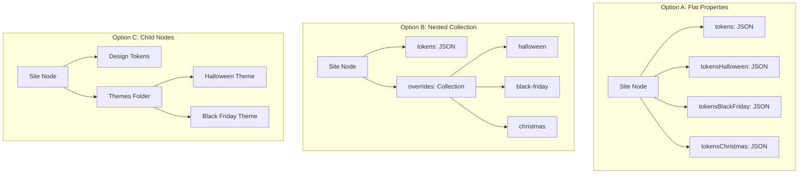
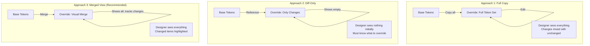
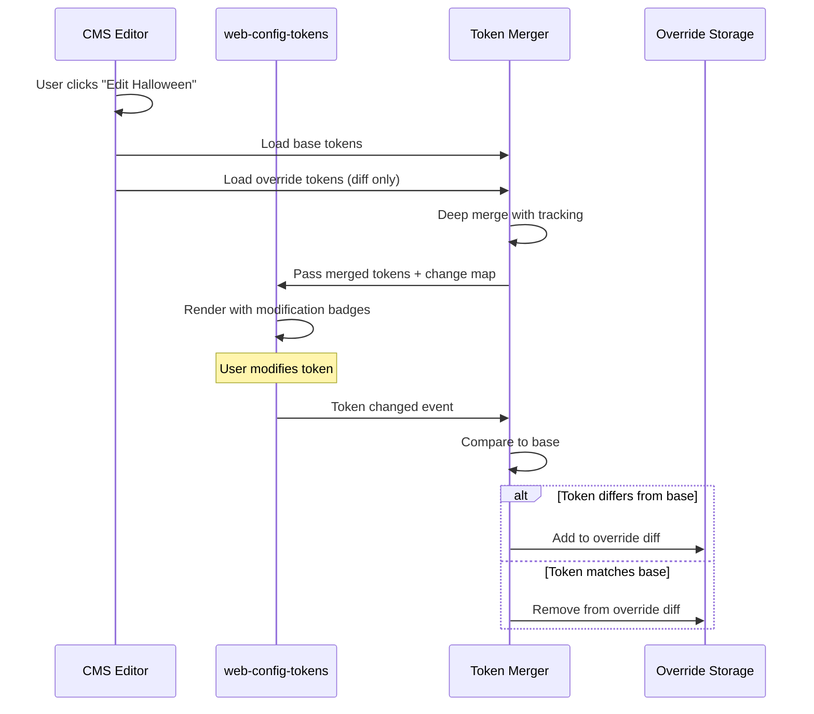
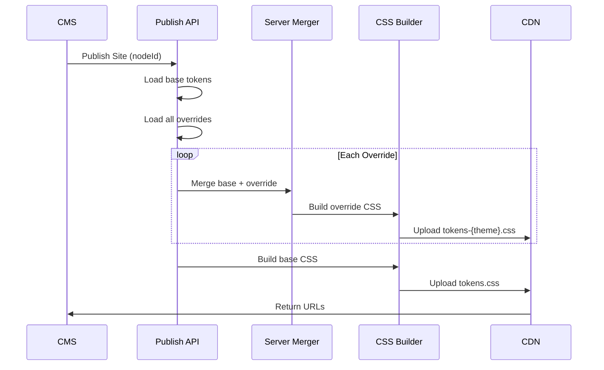

# CMS Data Model for Design Tokens & Overrides

This document explores how to structure the Site model in a CMS (like Umbraco) to handle base tokens and theme overrides.

---

## The Core Question

Where do overrides live, and how do they relate to base tokens?



---

## Recommended: Option B - Nested Structure

### Why This Works Best

| Aspect | Flat Properties | Nested Collection | Child Nodes |
|--------|-----------------|-------------------|-------------|
| Add new themes | Requires doc type change | Dynamic, no schema change | Dynamic |
| Theme scheduling | Separate fields needed | Built into collection item | Built into node |
| Preview in context | Complex | Natural | Complex |
| Permissions | All or nothing | Per-theme possible | Per-theme possible |
| Query performance | Fast | Fast | Slower (tree traversal) |
| Editor UX | Cluttered | Clean, organized | Navigation overhead |

---

## Data Model Design

### Site Document Type

```
Site (Document Type)
├── Content Tab
│   ├── siteName: Textstring
│   ├── domain: Textstring
│   └── ...other site fields
│
├── Design Tokens Tab
│   ├── tokens: Design Tokens Editor (JSON)
│   │   └── [Full token structure - blank slate]
│   │
│   └── themeOverrides: Nested Content / Block List
│       └── Theme Override (Element Type)
│           ├── name: Textstring (e.g., "Halloween")
│           ├── alias: Textstring (e.g., "halloween")
│           ├── tokens: Design Tokens Editor (JSON)
│           ├── isActive: True/False
│           ├── startDate: Date Picker
│           ├── endDate: Date Picker
│           └── priority: Numeric (for stacking order)
```

### Visual Representation

```
┌─────────────────────────────────────────────────────────────────┐
│ Site: Acme Store                                                │
├─────────────────────────────────────────────────────────────────┤
│ [Content] [Design Tokens] [Settings] [SEO]                      │
├─────────────────────────────────────────────────────────────────┤
│                                                                 │
│ BASE DESIGN TOKENS                                              │
│ ┌─────────────────────────────────────────────────────────────┐ │
│ │ <web-config-tokens>                                         │ │
│ │                                                             │ │
│ │  ▸ Colors                                                   │ │
│ │  ▸ Typography                                               │ │
│ │  ▸ Spacing                                                  │ │
│ │  ▸ Shadows                                                  │ │
│ │                                                             │ │
│ └─────────────────────────────────────────────────────────────┘ │
│                                                                 │
│ THEME OVERRIDES                                    [+ Add Theme]│
│ ┌─────────────────────────────────────────────────────────────┐ │
│ │ 🎃 Halloween                          Oct 15 - Nov 1   [Edit]│ │
│ │    Status: Scheduled │ Priority: 100                        │ │
│ ├─────────────────────────────────────────────────────────────┤ │
│ │ 🛒 Black Friday                       Nov 20 - Nov 30 [Edit]│ │
│ │    Status: Inactive │ Priority: 200                         │ │
│ ├─────────────────────────────────────────────────────────────┤ │
│ │ 🎄 Christmas                          Dec 1 - Dec 26  [Edit]│ │
│ │    Status: Inactive │ Priority: 150                         │ │
│ └─────────────────────────────────────────────────────────────┘ │
│                                                                 │
└─────────────────────────────────────────────────────────────────┘
```

---

## Override Editor: Pre-populated vs. Diff-Only

### The UX Challenge

When a designer opens an override editor, what should they see?



### Recommended: Approach 3 - Merged View with Change Tracking

**How it works:**

1. **Storage**: Override JSON only contains changed tokens (diff)
2. **Display**: Editor merges base + override for complete view
3. **Visual**: Changed tokens are highlighted/badged
4. **Save**: Only modified tokens are persisted to override

```
┌─────────────────────────────────────────────────────────────────┐
│ EDITING: Halloween Override                                     │
│ Based on: Base Design Tokens                    [View Base Only]│
├─────────────────────────────────────────────────────────────────┤
│                                                                 │
│ ▾ Colors                                                        │
│   ▾ Primitive                                                   │
│     ▾ Brand                                                     │
│       ┌─────────────────────────────────────────────────────┐   │
│       │ 🔶 500        #FF9800      ← MODIFIED (was #1976D2) │   │
│       └─────────────────────────────────────────────────────┘   │
│       ┌─────────────────────────────────────────────────────┐   │
│       │    600        #2563eb      (inherited from base)    │   │
│       └─────────────────────────────────────────────────────┘   │
│   ▾ Semantic                                                    │
│     ▾ Surface                                                   │
│       ┌─────────────────────────────────────────────────────┐   │
│       │ 🔶 base       #1A1A1A      ← MODIFIED (was #fff)    │   │
│       └─────────────────────────────────────────────────────┘   │
│                                                                 │
│ Legend: 🔶 Modified   ⚪ Inherited from base   🆕 New in override│
│                                                                 │
│ [Reset to Base] [Preview] [Save Override]                       │
└─────────────────────────────────────────────────────────────────┘
```

---

## Implementation: Merged View Editor

### Data Flow



### JavaScript Implementation

```javascript
class TokenMerger {
  constructor(baseTokens, overrideTokens = {}) {
    this.base = baseTokens;
    this.override = overrideTokens;
    this.changes = new Map(); // path -> 'modified' | 'added' | 'removed'
  }

  /**
   * Creates merged view with change tracking
   */
  getMergedTokens() {
    const merged = structuredClone(this.base);
    this.changes.clear();

    this.applyOverrides(merged, this.override, []);
    return { tokens: merged, changes: this.changes };
  }

  applyOverrides(target, overrides, path) {
    for (const [key, value] of Object.entries(overrides)) {
      const currentPath = [...path, key].join('.');

      if (value && typeof value === 'object' && !value.$value) {
        // Group - recurse
        if (!target[key]) target[key] = {};
        this.applyOverrides(target[key], value, [...path, key]);
      } else {
        // Token - apply and track
        const baseValue = this.getValueAtPath(this.base, currentPath);

        if (baseValue === undefined) {
          this.changes.set(currentPath, 'added');
        } else if (JSON.stringify(baseValue) !== JSON.stringify(value)) {
          this.changes.set(currentPath, 'modified');
        }

        target[key] = value;
      }
    }
  }

  /**
   * When user changes a token, determine if it should be in override
   */
  handleTokenChange(path, newValue) {
    const baseValue = this.getValueAtPath(this.base, path);

    if (JSON.stringify(baseValue) === JSON.stringify(newValue)) {
      // Matches base - remove from override
      this.removeFromOverride(path);
      this.changes.delete(path);
    } else {
      // Differs from base - add to override
      this.setInOverride(path, newValue);
      this.changes.set(path, baseValue ? 'modified' : 'added');
    }

    return this.override;
  }

  /**
   * Reset a specific token to base value
   */
  resetToBase(path) {
    this.removeFromOverride(path);
    this.changes.delete(path);
    return this.override;
  }

  /**
   * Get the override-only JSON (for storage)
   */
  getOverrideOnly() {
    return this.override;
  }

  // Helper methods
  getValueAtPath(obj, path) {
    return path.split('.').reduce((o, k) => o?.[k], obj);
  }

  setInOverride(path, value) {
    const keys = path.split('.');
    let current = this.override;
    for (let i = 0; i < keys.length - 1; i++) {
      if (!current[keys[i]]) current[keys[i]] = {};
      current = current[keys[i]];
    }
    current[keys[keys.length - 1]] = value;
  }

  removeFromOverride(path) {
    const keys = path.split('.');
    let current = this.override;
    for (let i = 0; i < keys.length - 1; i++) {
      if (!current[keys[i]]) return;
      current = current[keys[i]];
    }
    delete current[keys[keys.length - 1]];

    // Clean up empty parents
    this.cleanEmptyObjects(this.override);
  }

  cleanEmptyObjects(obj) {
    for (const key of Object.keys(obj)) {
      if (obj[key] && typeof obj[key] === 'object' && !obj[key].$value) {
        this.cleanEmptyObjects(obj[key]);
        if (Object.keys(obj[key]).length === 0) {
          delete obj[key];
        }
      }
    }
  }
}
```

### Enhanced Editor Component

```javascript
// Extended web-config-tokens for override mode
class WebConfigTokensOverride extends WebConfigTokens {
  #merger = null;
  #baseTokens = null;

  static get observedAttributes() {
    return ['src', 'base-src', 'mode'];
  }

  async connectedCallback() {
    const mode = this.getAttribute('mode'); // 'base' or 'override'
    const baseSrc = this.getAttribute('base-src');
    const src = this.getAttribute('src');

    if (mode === 'override' && baseSrc) {
      // Load base tokens first
      this.#baseTokens = await fetch(baseSrc).then(r => r.json());

      // Load override (may be empty)
      const overrideTokens = src
        ? await fetch(src).then(r => r.json())
        : {};

      // Create merger
      this.#merger = new TokenMerger(this.#baseTokens, overrideTokens);

      // Get merged view
      const { tokens, changes } = this.#merger.getMergedTokens();

      // Render with change tracking
      this.renderWithChanges(tokens, changes);
    } else {
      // Normal base editing mode
      super.connectedCallback();
    }
  }

  renderWithChanges(tokens, changes) {
    // Store changes map for styling
    this._changes = changes;

    // Call parent render
    this.renderTokens(tokens);

    // Apply visual indicators
    this.applyChangeIndicators();
  }

  applyChangeIndicators() {
    for (const [path, status] of this._changes) {
      const tokenEl = this.shadowRoot.querySelector(
        `design-token[data-path="${path}"]`
      );
      if (tokenEl) {
        tokenEl.setAttribute('data-override-status', status);
      }
    }
  }

  // Override save to only return diff
  toJSON() {
    if (this.#merger) {
      return this.#merger.getOverrideOnly();
    }
    return super.toJSON();
  }
}
```

### CSS for Change Indicators

```css
/* In design-token-styles */
design-token[data-override-status="modified"]::before {
  content: '●';
  color: #f59e0b;
  position: absolute;
  left: -1rem;
}

design-token[data-override-status="added"]::before {
  content: '+';
  color: #22c55e;
  position: absolute;
  left: -1rem;
}

design-token[data-override-status="modified"] [part="design-token-button"] {
  border-color: #f59e0b;
  background: #fffbeb;
}

design-token[data-override-status="added"] [part="design-token-button"] {
  border-color: #22c55e;
  background: #f0fdf4;
}
```

---

## Umbraco Implementation

### Document Type Configuration

```csharp
// Site.cs - Document Type
public class Site : PublishedContentModel
{
    // Base tokens - full token structure
    [JsonProperty("tokens")]
    public string Tokens { get; set; }

    // Theme overrides - Nested Content
    [JsonProperty("themeOverrides")]
    public IEnumerable<ThemeOverride> ThemeOverrides { get; set; }
}

// ThemeOverride.cs - Element Type
public class ThemeOverride
{
    public string Name { get; set; }
    public string Alias { get; set; }

    [JsonProperty("tokens")]
    public string Tokens { get; set; } // Only the diff!

    public bool IsActive { get; set; }
    public DateTime? StartDate { get; set; }
    public DateTime? EndDate { get; set; }
    public int Priority { get; set; }
}
```

### Property Editor for Override

```javascript
// override-editor.controller.js
angular.module('umbraco').controller('ThemeOverrideController',
  function($scope, $http) {

  // Get base tokens from parent Site node
  const siteNode = $scope.$parent.content;
  const baseTokens = JSON.parse(siteNode.properties.find(p =>
    p.alias === 'tokens'
  )?.value || '{}');

  // Current override value (diff only)
  const overrideTokens = $scope.model.value
    ? JSON.parse($scope.model.value)
    : {};

  // Create merger
  const merger = new TokenMerger(baseTokens, overrideTokens);

  // Initialize editor with merged view
  $scope.initEditor = function() {
    const { tokens, changes } = merger.getMergedTokens();

    // Create blob URL for merged tokens
    const blob = new Blob([JSON.stringify(tokens)], {
      type: 'application/json'
    });

    const editor = document.getElementById('override-editor');
    editor.setAttribute('src', URL.createObjectURL(blob));
    editor.setAttribute('mode', 'override');

    // Pass changes for visual indicators
    editor._changes = changes;
  };

  // Handle token changes
  $scope.onTokenChanged = function(path, newValue) {
    const updatedOverride = merger.handleTokenChange(path, newValue);

    // Save only the diff
    $scope.model.value = JSON.stringify(updatedOverride);
  };

  // Reset specific token to base
  $scope.resetToken = function(path) {
    const updatedOverride = merger.resetToBase(path);
    $scope.model.value = JSON.stringify(updatedOverride);
    $scope.initEditor(); // Re-render
  };
});
```

### Editor HTML

```html
<div ng-controller="ThemeOverrideController" ng-init="initEditor()">
  <div class="override-header">
    <h4>{{model.label}}</h4>
    <span class="badge" ng-if="getChangeCount() > 0">
      {{getChangeCount()}} modifications
    </span>
  </div>

  <div class="override-meta">
    <label>
      Active:
      <input type="checkbox" ng-model="model.value.isActive">
    </label>
    <label>
      Start Date:
      <input type="date" ng-model="model.value.startDate">
    </label>
    <label>
      End Date:
      <input type="date" ng-model="model.value.endDate">
    </label>
    <label>
      Priority:
      <input type="number" ng-model="model.value.priority" min="0" max="999">
    </label>
  </div>

  <div class="override-editor-container">
    <web-config-tokens
      id="override-editor"
      mode="override">
    </web-config-tokens>
  </div>

  <div class="override-actions">
    <button class="btn" ng-click="resetAllToBase()">
      Reset All to Base
    </button>
    <button class="btn btn-primary" ng-click="previewOverride()">
      Preview Theme
    </button>
  </div>
</div>
```

---

## Storage Examples

### Base Tokens (Full)

```json
{
  "$name": "Acme Store Design System",
  "color": {
    "primitive": {
      "brand": {
        "500": { "$type": "color", "$value": "#1976D2" },
        "600": { "$type": "color", "$value": "#1565C0" }
      },
      "neutral": {
        "0": { "$type": "color", "$value": "#ffffff" },
        "950": { "$type": "color", "$value": "#0a0a0a" }
      }
    },
    "semantic": {
      "surface": {
        "base": {
          "$type": "color",
          "$value": "{color.primitive.neutral.0}",
          "$extensions": {
            "css": {
              "var": "--surface-base",
              "fn": "light-dark",
              "args": ["{color.primitive.neutral.0}", "{color.primitive.neutral.950}"]
            }
          }
        }
      }
    }
  },
  "typography": {
    "primitive": {
      "fontFamily": {
        "sans": { "$type": "fontFamily", "$value": ["Inter", "sans-serif"] }
      }
    }
  }
}
```

### Halloween Override (Diff Only)

```json
{
  "$name": "Halloween Theme",
  "color": {
    "primitive": {
      "brand": {
        "500": { "$type": "color", "$value": "#FF9800" },
        "600": { "$type": "color", "$value": "#F57C00" }
      }
    },
    "semantic": {
      "surface": {
        "base": {
          "$type": "color",
          "$value": "{color.primitive.neutral.950}",
          "$extensions": {
            "css": {
              "var": "--surface-base",
              "fn": "light-dark",
              "args": ["{color.primitive.neutral.900}", "{color.primitive.neutral.950}"]
            }
          }
        }
      }
    }
  }
}
```

Note: The override is ~60% smaller because it only contains changes.

---

## Build/Publish Flow



---

## Summary

| Aspect | Recommendation |
|--------|----------------|
| **Base tokens** | Single JSON property on Site |
| **Overrides** | Nested Content / Block List collection |
| **Override storage** | Diff-only (not full copy) |
| **Editor display** | Merged view with change indicators |
| **Scheduling** | Fields on override item (startDate, endDate, isActive) |
| **Priority** | Numeric field for stacking multiple overrides |

---

## Related Documentation

- [CMS Integration Flows](./cms-integration-flows.md)
- [Multi-Site Architecture](./multi-site-architecture.md)
- [Brand Hierarchy](./brand-hierarchy.md)
