# CMS Integration Flows & Theme Override Strategies

This document explores various approaches for integrating the `<web-config-tokens>` visual editor into a CMS, handling theme overrides, and providing real-time preview capabilities.

---

## Table of Contents

1. [The Core Challenge](#the-core-challenge)
2. [Architecture Overview](#architecture-overview)
3. [Theme Override Strategies](#theme-override-strategies)
4. [Webhook & Build Strategies](#webhook--build-strategies)
5. [Real-Time Preview (Without Deploy)](#real-time-preview-without-deploy)
6. [Umbraco-Specific Implementation](#umbraco-specific-implementation)
7. [Recommended Approach](#recommended-approach)

---

## The Core Challenge

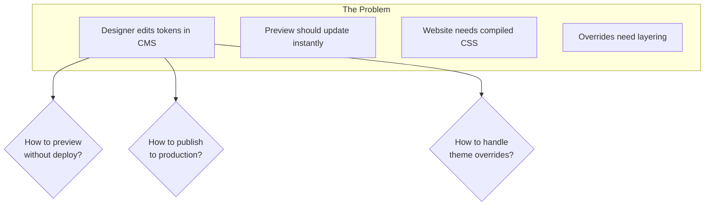

**Key Questions:**
1. How does a designer preview changes instantly without deploying?
2. How do changes get published to production websites?
3. How are theme overrides (Halloween, Black Friday) layered on top of base tokens?
4. How does versioning/rollback work?

---

## Architecture Overview

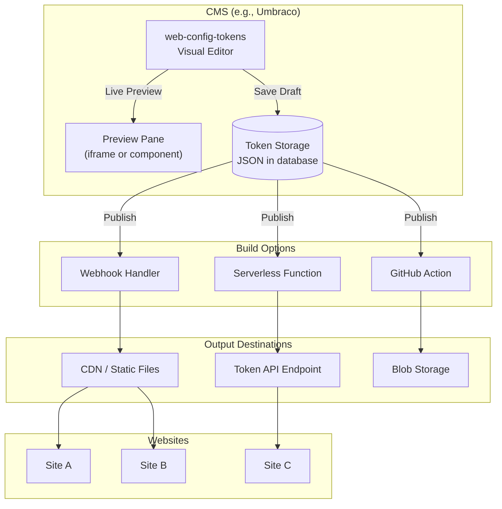

---

## Theme Override Strategies

### Strategy 1: Flat Structure with Mode Selection

Store all themes in one JSON with a mode selector.

```json
{
  "$extensions": {
    "modes": ["default", "halloween", "black-friday", "christmas"],
    "activeMode": "default"
  },
  "raw": {
    "color": {
      "$type": "color",
      "brand": {
        "500": {
          "$value": "#1976D2",
          "$extensions": {
            "modes": {
              "halloween": "#FF9800",
              "black-friday": "#212121",
              "christmas": "#C62828"
            }
          }
        }
      }
    }
  }
}
```

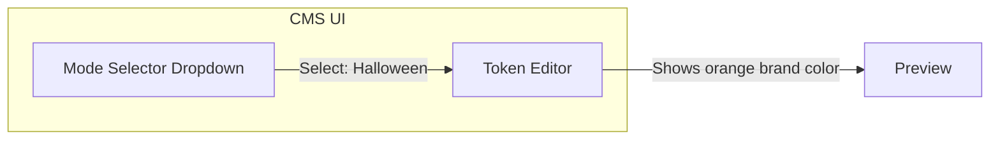

**Pros:**
- Single file to manage
- Easy to see all variations at once
- Aligns with Figma Variable Modes

**Cons:**
- File gets large with many modes
- Can't have independent theme schedules
- All-or-nothing mode switching

---

### Strategy 2: Base + Override Files (Recommended)

Separate files with clear inheritance.

```
/tokens/
├── site-a/
│   ├── base.tokens.json          ← Always active
│   └── overrides/
│       ├── halloween.tokens.json  ← Layered on top when active
│       ├── black-friday.tokens.json
│       └── christmas.tokens.json
```

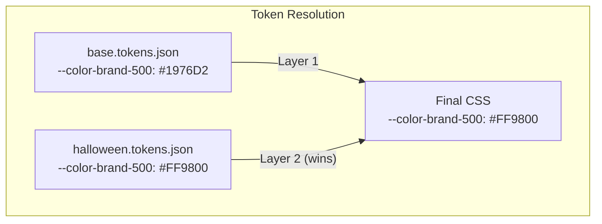

**CMS UI Flow:**

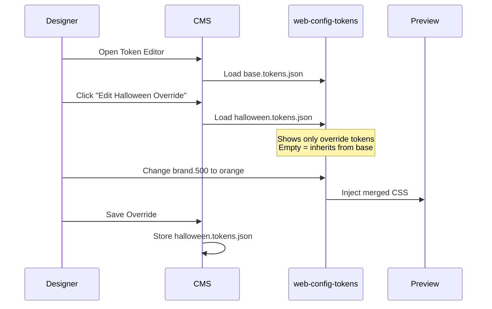

**Pros:**
- Clear separation of concerns
- Override files are small (only differences)
- Each theme can have independent scheduling
- Easy to delete/disable a theme

**Cons:**
- Multiple files to manage
- Need UI to switch between base/override editing

---

### Strategy 3: Inheritance Chain with `$extends`

Use W3C `$extends` for explicit inheritance.

```json
{
  "$extends": "./base.tokens.json",
  "raw": {
    "color": {
      "brand": {
        "500": { "$value": "#FF9800" }
      }
    }
  }
}
```

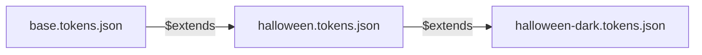

**Pros:**
- Explicit inheritance chain
- Can have theme variants (Halloween Light/Dark)
- W3C compliant

**Cons:**
- Requires resolver to follow `$extends` chain
- More complex build process

---

### Strategy 4: Delta/Diff Storage

Store only the differences from base.

```json
{
  "$baseRef": "base.tokens.json",
  "$deltas": [
    { "path": "raw.color.brand.500", "value": "#FF9800" },
    { "path": "raw.color.brand.600", "value": "#F57C00" },
    { "path": "color.background.default", "value": "#1A1A1A" }
  ]
}
```

**Pros:**
- Minimal storage
- Easy to see exactly what changed
- Simple merge logic

**Cons:**
- Custom format (not W3C standard)
- Need delta-to-tokens converter

---

## Webhook & Build Strategies

### Strategy A: On-Save Webhook (Real-Time)

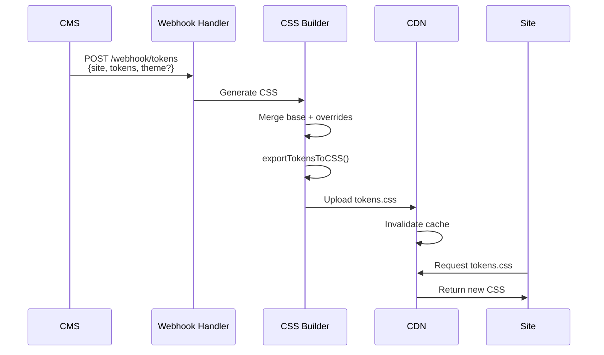

**Webhook Payload:**

```json
{
  "event": "tokens.published",
  "site": "site-a",
  "theme": null,
  "tokens": {},
  "timestamp": "2025-01-21T10:30:00Z",
  "user": "designer@example.com"
}
```

**Webhook Handler (Cloudflare Worker example):**

```javascript
export default {
  async fetch(request, env) {
    const { event, site, theme, tokens } = await request.json();

    if (event !== 'tokens.published') {
      return new Response('Unknown event', { status: 400 });
    }

    // Generate CSS
    const { exportTokensToCSS } = await import('@browser.style/design-token-utils');
    const css = exportTokensToCSS(tokens, {
      layer: theme ? `theme-${theme}` : 'base',
      selector: ':root'
    });

    // Store in R2/KV
    const filename = theme
      ? `${site}/tokens-${theme}.css`
      : `${site}/tokens.css`;

    await env.TOKENS_BUCKET.put(filename, css, {
      httpMetadata: { contentType: 'text/css' }
    });

    // Purge CDN cache
    await fetch(
      `https://api.cloudflare.com/client/v4/zones/${env.ZONE_ID}/purge_cache`,
      {
        method: 'POST',
        headers: { Authorization: `Bearer ${env.CF_TOKEN}` },
        body: JSON.stringify({
          files: [`https://tokens.example.com/${filename}`]
        })
      }
    );

    return Response.json({
      success: true,
      url: `https://tokens.example.com/${filename}`
    });
  }
};
```

---

### Strategy B: Scheduled Build (Batch)

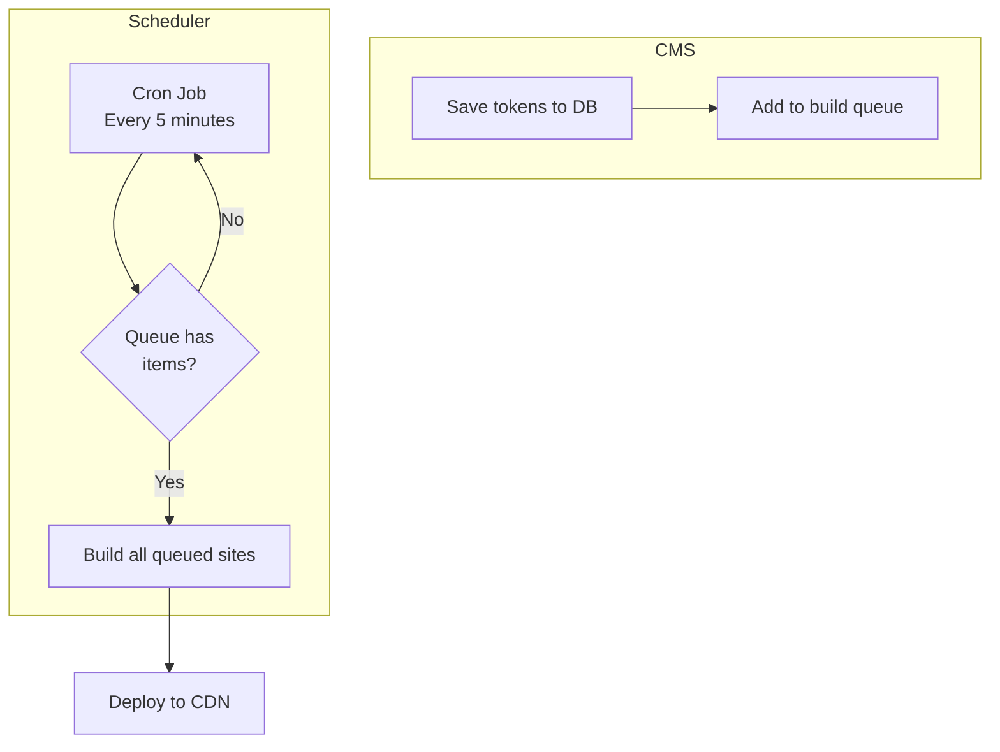

**Pros:**
- Batches multiple saves
- Reduces build frequency
- Good for high-traffic CMS

**Cons:**
- Delay between save and publish
- More complex infrastructure

---

### Strategy C: Git-Based Workflow

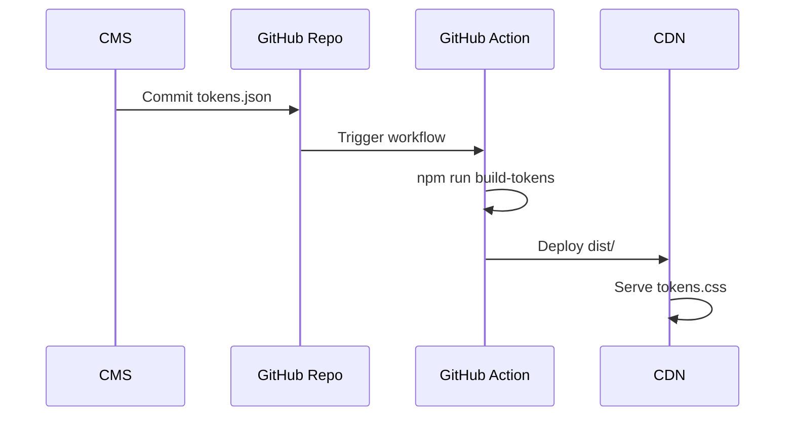

**Pros:**
- Version control built-in
- Easy rollback (git revert)
- PR-based review workflow possible

**Cons:**
- Slower than direct webhook
- Requires Git integration in CMS

---

### Strategy D: Hybrid (Draft + Publish)

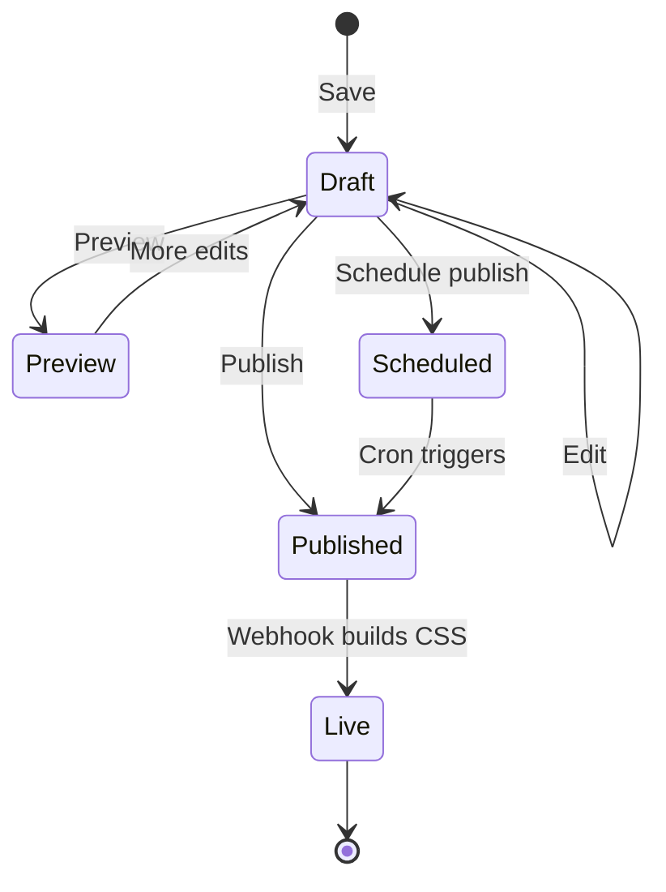

**Database Schema:**

```sql
CREATE TABLE token_versions (
  id UUID PRIMARY KEY,
  site_id UUID REFERENCES sites(id),
  theme_slug VARCHAR(100),
  tokens JSONB NOT NULL,
  status ENUM('draft', 'scheduled', 'published', 'archived'),
  publish_at TIMESTAMP,
  published_at TIMESTAMP,
  created_by UUID REFERENCES users(id),
  created_at TIMESTAMP DEFAULT NOW()
);
```

---

## Real-Time Preview (Without Deploy)

This is the key UX challenge: letting designers see changes instantly.

### Approach 1: Inject CSS into Preview iframe

```mermaid
flowchart LR
    subgraph CMS
        Editor[Token Editor]
        Preview[Preview iframe<br/>src="/preview/site-a"]
    end

    Editor -->|postMessage| Preview
    Preview -->|Inject style tag| DOM
```

**Implementation (CMS side):**

```javascript
// In CMS token editor
const editor = document.querySelector('web-config-tokens');
const previewFrame = document.querySelector('iframe#preview');

editor.addEventListener('token-changed', (e) => {
  const { token, cssVar } = e.detail;

  // Send to preview iframe
  previewFrame.contentWindow.postMessage({
    type: 'TOKEN_UPDATE',
    cssVar,
    value: toCssValue(token)
  }, '*');
});

// "Preview All" button - sends full CSS
document.getElementById('preview-all').addEventListener('click', () => {
  const tokens = editor.toJSON();
  const css = exportTokensToCSS(tokens, { selector: ':root' });

  previewFrame.contentWindow.postMessage({
    type: 'FULL_CSS_UPDATE',
    css
  }, '*');
});
```

**Implementation (Preview iframe):**

```javascript
// In preview iframe (injected script)
window.addEventListener('message', (e) => {
  if (e.data.type === 'TOKEN_UPDATE') {
    document.documentElement.style.setProperty(e.data.cssVar, e.data.value);
  }

  if (e.data.type === 'FULL_CSS_UPDATE') {
    let style = document.getElementById('cms-preview-tokens');
    if (!style) {
      style = document.createElement('style');
      style.id = 'cms-preview-tokens';
      document.head.appendChild(style);
    }
    style.textContent = e.data.css;
  }
});
```

---

### Approach 2: CSS Custom Property Override Layer

The preview site loads a special "preview mode" that accepts runtime overrides.

```html
<!-- Preview site template -->
<head>
  <!-- Base tokens (production) -->
  <link rel="stylesheet" href="/tokens.css">

  <!-- Preview override layer (empty by default) -->
  <style id="preview-overrides"></style>
</head>
```

**Preview Controller:**

```javascript
class PreviewController {
  constructor() {
    this.overrideSheet = document.getElementById('preview-overrides');
    this.setupMessageListener();
  }

  setupMessageListener() {
    window.addEventListener('message', (e) => {
      if (e.origin !== 'https://cms.example.com') return;

      switch (e.data.type) {
        case 'SET_TOKENS':
          this.applyTokens(e.data.tokens);
          break;
        case 'SET_THEME':
          this.applyTheme(e.data.theme);
          break;
        case 'RESET':
          this.reset();
          break;
      }
    });
  }

  applyTokens(tokens) {
    const css = this.tokensToCSS(tokens);
    this.overrideSheet.textContent = css;
  }

  applyTheme(themeTokens) {
    const merged = { ...this.currentTokens, ...themeTokens };
    this.applyTokens(merged);
  }

  reset() {
    this.overrideSheet.textContent = '';
  }

  tokensToCSS(tokens) {
    let css = ':root {\n';
    for (const [key, value] of Object.entries(tokens)) {
      css += `  ${key}: ${value};\n`;
    }
    css += '}';
    return css;
  }
}

new PreviewController();
```

---

### Approach 3: Server-Side Preview Rendering

For SSR frameworks, render preview with inline tokens.

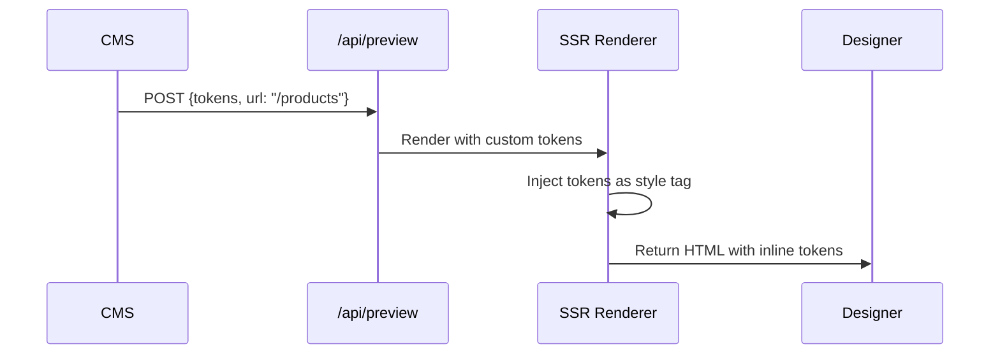

**Next.js API Route Example:**

```javascript
// /api/preview/[...path].js
export default async function handler(req, res) {
  const { tokens } = req.body;
  const path = req.query.path.join('/');

  // Generate CSS from tokens
  const { exportTokensToCSS } = await import('@browser.style/design-token-utils');
  const css = exportTokensToCSS(tokens, { selector: ':root' });

  // Fetch the actual page
  const pageHtml = await fetch(`${process.env.SITE_URL}/${path}`)
    .then(r => r.text());

  // Inject tokens before closing head tag
  const styleTag = `<style id="preview-tokens">${css}</style>`;
  const modifiedHtml = pageHtml.replace('</head>', `${styleTag}</head>`);

  res.setHeader('Content-Type', 'text/html');
  res.send(modifiedHtml);
}
```

---

### Approach 4: Live Preview Component

Create a wrapper component that provides live token context.

```javascript
// preview-wrapper.js
class PreviewWrapper extends HTMLElement {
  constructor() {
    super();
    this.attachShadow({ mode: 'open' });
  }

  connectedCallback() {
    this.tokenSheet = new CSSStyleSheet();
    this.shadowRoot.adoptedStyleSheets = [this.tokenSheet];

    const slot = document.createElement('slot');
    this.shadowRoot.appendChild(slot);

    window.addEventListener('message', this.handleMessage.bind(this));
  }

  handleMessage(e) {
    if (e.data.type === 'PREVIEW_TOKENS') {
      this.tokenSheet.replaceSync(e.data.css);
    }
  }

  setTokens(css) {
    this.tokenSheet.replaceSync(css);
  }
}

customElements.define('preview-wrapper', PreviewWrapper);
```

**Usage in CMS:**

```html
<div class="cms-layout">
  <div class="editor-pane">
    <web-config-tokens src="/api/tokens/site-a" id="editor"></web-config-tokens>
  </div>

  <div class="preview-pane">
    <preview-wrapper id="preview">
      <iframe src="/preview/site-a"></iframe>
    </preview-wrapper>
  </div>
</div>

<script>
  const editor = document.getElementById('editor');
  const preview = document.getElementById('preview');

  let timeout;
  editor.addEventListener('token-changed', () => {
    clearTimeout(timeout);
    timeout = setTimeout(() => {
      const tokens = editor.toJSON();
      const css = exportTokensToCSS(tokens, { selector: ':root' });
      preview.setTokens(css);
    }, 100);
  });
</script>
```

---

### Approach 5: WebSocket Real-Time Sync

For collaborative editing or instant preview across devices.

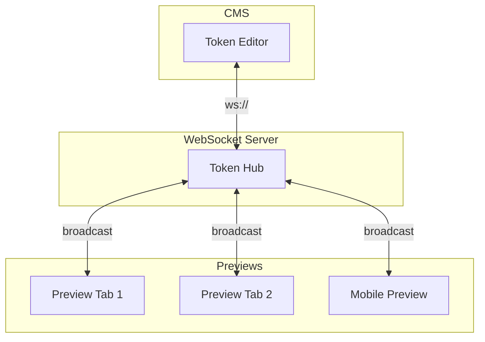

**Server (Node.js + ws):**

```javascript
import { WebSocketServer } from 'ws';

const wss = new WebSocketServer({ port: 8080 });
const rooms = new Map();

wss.on('connection', (ws, req) => {
  const site = new URL(req.url, 'http://localhost').searchParams.get('site');

  if (!rooms.has(site)) rooms.set(site, new Set());
  rooms.get(site).add(ws);

  ws.on('message', (data) => {
    const msg = JSON.parse(data);

    if (msg.type === 'TOKEN_UPDATE') {
      for (const client of rooms.get(site)) {
        if (client !== ws && client.readyState === 1) {
          client.send(data);
        }
      }
    }
  });

  ws.on('close', () => {
    rooms.get(site)?.delete(ws);
  });
});
```

**Client (Editor):**

```javascript
const ws = new WebSocket('wss://preview.example.com?site=site-a');

editor.addEventListener('token-changed', (e) => {
  ws.send(JSON.stringify({
    type: 'TOKEN_UPDATE',
    cssVar: e.detail.cssVar,
    value: toCssValue(e.detail.token)
  }));
});
```

**Client (Preview):**

```javascript
const ws = new WebSocket('wss://preview.example.com?site=site-a');

ws.onmessage = (e) => {
  const { type, cssVar, value } = JSON.parse(e.data);
  if (type === 'TOKEN_UPDATE') {
    document.documentElement.style.setProperty(cssVar, value);
  }
};
```

---

## Umbraco-Specific Implementation

### Property Editor Architecture

```mermaid
flowchart TB
    subgraph Umbraco
        PE[Property Editor<br/>Design Tokens]
        Preview[Backoffice Preview]
        API[/umbraco/api/tokens]
    end

    subgraph Frontend
        Site[Published Site]
    end

    PE -->|Save| API
    API -->|Store| DB[(Database)]
    PE -->|Live CSS| Preview
    API -->|Publish webhook| Webhook
    Webhook -->|Build CSS| CDN
    CDN -->|Serve| Site
```

### Custom Property Editor

**Package Manifest (`package.manifest`):**

```json
{
  "propertyEditors": [
    {
      "alias": "BrowserStyle.DesignTokens",
      "name": "Design Tokens Editor",
      "editor": {
        "view": "~/App_Plugins/DesignTokens/editor.html",
        "valueType": "JSON"
      },
      "prevalues": {
        "fields": [
          {
            "label": "Token Schema",
            "key": "schema",
            "view": "textarea"
          },
          {
            "label": "Preview URL",
            "key": "previewUrl",
            "view": "textbox"
          }
        ]
      }
    }
  ],
  "javascript": [
    "~/App_Plugins/DesignTokens/editor.controller.js"
  ],
  "css": [
    "~/App_Plugins/DesignTokens/editor.css"
  ]
}
```

**Editor View (`editor.html`):**

```html
<div ng-controller="DesignTokensController">
  <div class="design-tokens-editor">
    <!-- Web Component Editor -->
    <web-config-tokens
      id="token-editor"
      ng-attr-src="{{tokensSrc}}">
    </web-config-tokens>

    <!-- Theme Selector -->
    <div class="theme-controls" ng-if="themes.length">
      <label>Editing Theme:</label>
      <select ng-model="activeTheme" ng-change="loadTheme(activeTheme)">
        <option value="">Base Tokens</option>
        <option ng-repeat="theme in themes" value="{{theme.alias}}">
          {{theme.name}}
        </option>
      </select>
      <button ng-click="createTheme()">+ New Theme</button>
    </div>

    <!-- Preview Panel -->
    <div class="preview-panel">
      <iframe
        ng-src="{{previewUrl}}"
        id="preview-frame"
        sandbox="allow-scripts allow-same-origin">
      </iframe>
    </div>

    <!-- Actions -->
    <div class="actions">
      <button class="btn" ng-click="previewChanges()">Preview</button>
      <button class="btn btn-success" ng-click="saveTokens()">Save Draft</button>
      <button class="btn btn-primary" ng-click="publishTokens()">Publish</button>
    </div>
  </div>
</div>
```

**Controller (`editor.controller.js`):**

```javascript
angular.module('umbraco').controller('DesignTokensController',
  function($scope, $http, notificationsService) {

  $scope.themes = [];
  $scope.activeTheme = '';

  $scope.$watch('model.value', function(newVal) {
    if (newVal) {
      $scope.loadTokensIntoEditor(newVal);
    }
  });

  $scope.loadTokensIntoEditor = function(tokens) {
    const editor = document.getElementById('token-editor');
    const blob = new Blob(
      [JSON.stringify(tokens)],
      { type: 'application/json' }
    );
    editor.setAttribute('src', URL.createObjectURL(blob));
  };

  $scope.previewChanges = function() {
    const editor = document.getElementById('token-editor');
    const tokens = editor.toJSON();
    const css = exportTokensToCSS(tokens, { selector: ':root' });

    const preview = document.getElementById('preview-frame');
    preview.contentWindow.postMessage({
      type: 'PREVIEW_TOKENS',
      css: css
    }, '*');

    notificationsService.success('Preview', 'Tokens applied to preview');
  };

  $scope.saveTokens = function() {
    const editor = document.getElementById('token-editor');
    const tokens = editor.toJSON();
    $scope.model.value = tokens;
    notificationsService.success('Saved', 'Token draft saved');
  };

  $scope.publishTokens = function() {
    const editor = document.getElementById('token-editor');
    const tokens = editor.toJSON();
    $scope.model.value = tokens;

    $http.post('/umbraco/api/designtokens/publish', {
      nodeId: $scope.model.parentId,
      theme: $scope.activeTheme || null,
      tokens: tokens
    }).then(function(response) {
      notificationsService.success(
        'Published',
        'Tokens published to ' + response.data.url
      );
    }).catch(function(error) {
      notificationsService.error(
        'Error',
        'Failed to publish: ' + error.message
      );
    });
  };

  $scope.loadTheme = function(themeAlias) {
    if (!themeAlias) {
      $scope.loadTokensIntoEditor($scope.model.value);
      return;
    }

    $http.get('/umbraco/api/designtokens/theme/' + themeAlias, {
      params: { nodeId: $scope.model.parentId }
    }).then(function(response) {
      $scope.loadTokensIntoEditor(response.data.tokens);
    });
  };

  $scope.createTheme = function() {
    const name = prompt('Theme name (e.g., Halloween):');
    if (!name) return;

    const alias = name.toLowerCase().replace(/\s+/g, '-');

    $http.post('/umbraco/api/designtokens/theme', {
      nodeId: $scope.model.parentId,
      name: name,
      alias: alias,
      tokens: {}
    }).then(function() {
      $scope.themes.push({ name, alias });
      $scope.activeTheme = alias;
      notificationsService.success('Created', 'Theme created');
    });
  };
});
```

### Umbraco API Controller

```csharp
[PluginController("DesignTokens")]
public class DesignTokensApiController : UmbracoAuthorizedJsonController
{
    private readonly IWebhookService _webhookService;
    private readonly IDesignTokenRepository _tokenRepository;

    [HttpPost]
    public async Task<IActionResult> Publish(
        [FromBody] PublishTokensRequest request)
    {
        await _tokenRepository.SaveAsync(
            request.NodeId,
            request.Theme,
            request.Tokens
        );

        var result = await _webhookService.TriggerAsync(new WebhookPayload
        {
            Event = "tokens.published",
            Site = GetSiteAlias(request.NodeId),
            Theme = request.Theme,
            Tokens = request.Tokens,
            Timestamp = DateTime.UtcNow
        });

        return Ok(new { url = result.CssUrl });
    }

    [HttpGet("theme/{alias}")]
    public async Task<IActionResult> GetTheme(
        string alias,
        [FromQuery] int nodeId)
    {
        var tokens = await _tokenRepository.GetThemeAsync(nodeId, alias);
        return Ok(new { tokens });
    }

    [HttpPost("theme")]
    public async Task<IActionResult> CreateTheme(
        [FromBody] CreateThemeRequest request)
    {
        await _tokenRepository.CreateThemeAsync(
            request.NodeId,
            request.Name,
            request.Alias,
            request.Tokens
        );
        return Ok();
    }
}
```

---

## Recommended Approach

Based on the analysis, here is the recommended architecture:

### For Most Projects

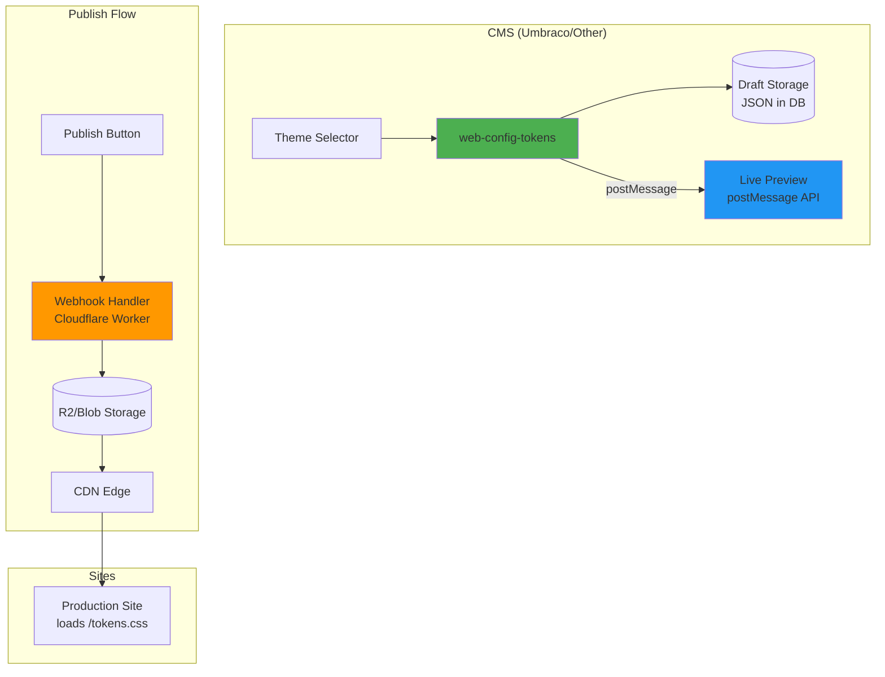

### Key Decisions

| Aspect | Recommendation | Reason |
|--------|----------------|--------|
| **Theme storage** | Separate files (Strategy 2) | Clear separation, easy scheduling |
| **Preview** | postMessage to iframe (Approach 1) | Works everywhere, no server needed |
| **Publish** | On-demand webhook (Strategy A) | Instant publish, simple infrastructure |
| **CSS output** | Cloudflare R2 + CDN | Fast, global, cheap |
| **Versioning** | Database with status field | Draft/Scheduled/Published workflow |
| **Theme activation** | Database schedule + API | Flexible, supports preview |

### Implementation Checklist

1. **CMS Property Editor**
   - [ ] Embed `web-config-tokens` component
   - [ ] Add theme selector dropdown
   - [ ] Add preview iframe with postMessage
   - [ ] Implement Save Draft / Publish buttons

2. **Preview System**
   - [ ] Add preview script to site template
   - [ ] Listen for postMessage token updates
   - [ ] Support full CSS replacement and single token updates

3. **Webhook Handler**
   - [ ] Create Cloudflare Worker or serverless function
   - [ ] Accept token JSON, generate CSS
   - [ ] Upload to storage (R2, S3, Blob)
   - [ ] Purge CDN cache

4. **Theme Scheduling**
   - [ ] Database table for themes with dates
   - [ ] API endpoint for active theme
   - [ ] Cron job or edge function for activation

5. **Production Sites**
   - [ ] Load base tokens.css
   - [ ] Check for active theme, load override CSS
   - [ ] Optional: Add preview mode for CMS users

---

## Summary: Three States of Tokens

```mermaid
stateDiagram-v2
    direction LR

    state "Draft" as D {
        note left of D: Stored in CMS DB
        note right of D: Preview via postMessage
    }

    state "Published" as P {
        note left of P: Webhook triggered
        note right of P: CSS on CDN
    }

    state "Scheduled" as S {
        note left of S: Future publish date
        note right of S: Cron activates
    }

    [*] --> D: Designer saves
    D --> D: More edits
    D --> P: Publish now
    D --> S: Schedule
    S --> P: Date reached
    P --> D: Edit again
```

---

## Appendix: Actual Token Format in Use

Based on the existing `design.tokens.json` in this project, here are the advanced patterns already supported:

### CSS Function Extensions

The `$extensions.css` object supports advanced CSS functions:

```json
{
  "surface": {
    "base": {
      "$type": "color",
      "$value": "{color.primitive.neutral.0}",
      "$extensions": {
        "css": {
          "var": "--surface-base",
          "fn": "light-dark",
          "args": ["{color.primitive.neutral.0}", "{color.primitive.neutral.950}"]
        }
      }
    }
  }
}
```

**Generates:**
```css
--surface-base: light-dark(var(--neutral-0), var(--neutral-950));
```

### Supported CSS Functions

| Function | Use Case | Example |
|----------|----------|---------|
| `light-dark` | Dark mode support | `light-dark(#fff, #000)` |
| `clamp` | Fluid sizing | `clamp(1rem, 4vw, 2rem)` |
| Custom | Any CSS function | `fn: "oklab", args: [...]` |

### Wide Gamut Colors

```json
{
  "brand": {
    "500": {
      "$type": "color",
      "$value": {
        "colorSpace": "display-p3",
        "components": [0.1, 0.46, 0.82],
        "alpha": 1,
        "hex": "#1976D2"
      }
    }
  }
}
```

### Gradient Types

The system supports linear, radial, and conic gradients with custom extensions:

```json
{
  "glow": {
    "$type": "gradient",
    "$value": [
      { "color": "{color.primitive.brand.500}", "position": 0 },
      { "color": "{color.primitive.vivid.purple}", "position": 0.33 },
      { "color": "{color.primitive.vivid.lime}", "position": 0.66 },
      { "color": "{color.primitive.brand.500}", "position": 1 }
    ],
    "$extensions": {
      "css": {
        "var": "--gradient-glow",
        "gradientType": "conic",
        "angle": "0deg",
        "position": "center"
      }
    }
  }
}
```

### Theme Override Considerations

When creating theme overrides (Halloween, Black Friday), the `$extensions.css.fn` patterns should be preserved. The override should only change the relevant values:

**Base tokens (showing `light-dark` function):**
```json
{
  "color": {
    "semantic": {
      "surface": {
        "base": {
          "$type": "color",
          "$value": "{color.primitive.neutral.0}",
          "$extensions": {
            "css": {
              "var": "--surface-base",
              "fn": "light-dark",
              "args": ["{color.primitive.neutral.0}", "{color.primitive.neutral.950}"]
            }
          }
        }
      }
    }
  }
}
```

**Halloween override (changes args to darker palette):**
```json
{
  "color": {
    "semantic": {
      "surface": {
        "base": {
          "$type": "color",
          "$value": "{color.primitive.neutral.950}",
          "$extensions": {
            "css": {
              "var": "--surface-base",
              "fn": "light-dark",
              "args": ["{color.primitive.neutral.900}", "{color.primitive.neutral.950}"]
            }
          }
        }
      }
    },
    "primitive": {
      "brand": {
        "500": { "$type": "color", "$value": "#FF9800" },
        "600": { "$type": "color", "$value": "#F57C00" }
      }
    }
  }
}
```

This allows Halloween to have a dark-by-default theme while still supporting `light-dark()` for accessibility.

---

## Related Documentation

- [Multi-Site Architecture](./multi-site-architecture.md)
- [Brand Hierarchy](./brand-hierarchy.md)
- [W3C Design Tokens Format](https://www.designtokens.org/TR/drafts/format/)
